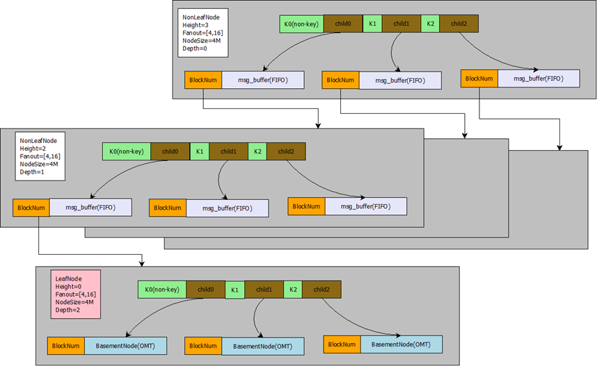
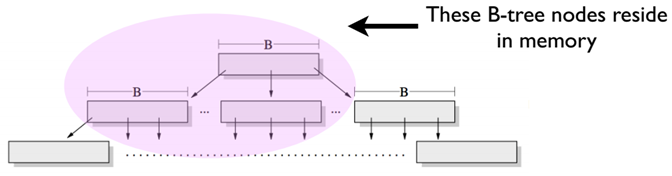
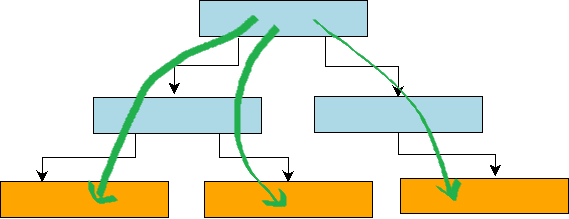
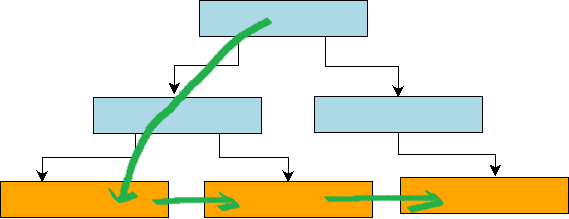
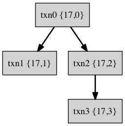
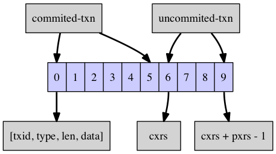
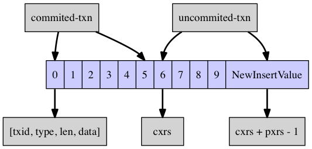
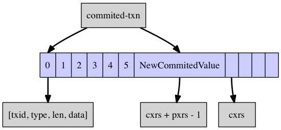

# MySQL 高性能存储引擎：TokuDB初探

2016-12-13

在安装MariaDB的时候了解到代替InnoDB的TokuDB，看简介非常的棒，这里对ToduDB做一个初步的整理，使用后再做更多的分享。

## 什么是TokuDB？

在MySQL最流行的支持全事务的引擎为INNODB。其特点是数据本身是用B-TREE来组织，数据本身即是庞大的根据主键聚簇的B-TREE索引。 所以在这点上，写入速度就会有些降低，因为要每次写入要用一次IO来做索引树的重排。特别是当数据量本身比内存大很多的情况下，CPU本身被磁盘IO纠缠的做不了其他事情了。这时我们要考虑如何减少对磁盘的IO来排解CPU的处境，常见的方法有：

*   把INNODB 个PAGE增大（默认16KB），但增大也就带来了一些缺陷。 比如，对磁盘进行CHECKPOINT的时间将延后。
*   把日志文件放到更快速的磁盘上，比如SSD。

TokuDB 是一个支持事务的“新”引擎，有着出色的数据压缩功能，由美国 TokuTek 公司（现在已经被 Percona 公司收购）研发。拥有出色的数据压缩功能，如果您的数据写多读少，而且数据量比较大，强烈建议您使用TokuDB，以节省空间成本，并大幅度降低存储使用量和IOPS开销，不过相应的会增加 CPU 的压力。

## TokuDB 的特性

**1****.****丰富的索引类型以及索引的快速创建**

TokuDB 除了支持现有的索引类型外， 还增加了(第二)集合索引, 以满足多样性的覆盖索引的查询, 在快速创建索引方面提高了查询的效率

**2.(****第二)集合索引**

也可以称作非主键的集合索引, 这类索引也包含了表中的所有列, 可以用于覆盖索引的查询需要, 比如以下示例, 在where 条件中直接命中 index_b 索引, 避免了从主键中再查找一次.

<table class="crayon-table" style=""><tbody><tr class="crayon-row"><td class="crayon-nums " data-settings="show">

1

2

3

4

5

6

7

8

9

10

</td><td class="crayon-code">

CREATE TABLE table (

column_a INT,

column_b INT,

column_c INT,

PRIMARY KEY index_a (column_a),

CLUSTERING KEY index_b (column_b)) ENGINE = TokuDB;

&nbsp;

SELECT column_c

FROM table

WHERE column_b BETWEEN 10 AND 100;

</td></tr></tbody></table>

见: [http://tokutek.com/2009/05/introducing\_multiple\_clustering_indexes/](http://tokutek.com/2009/05/introducing_multiple_clustering_indexes/)

**3.索引在线创建(Hot Index Creation)**

TokuDB 允许直接给表增加索引而不影响更新语句(insert, update 等)的执行。可以通过变量 tokudb\_create\_index_online 来控制是否开启该特性, 不过遗憾的是目前还只能通过 CREATE INDEX 语法实现在线创建, 不能通过 ALTER TABLE 实现. 这种方式比通常的创建方式慢了许多, 创建的过程可以通过 show processlist 查看。不过 tokudb 不支持在线删除索引, 删除索引的时候会对标加全局锁。

<table class="crayon-table" style=""><tbody><tr class="crayon-row"><td class="crayon-nums " data-settings="show">

1

2

3

4

</td><td class="crayon-code">

&gt; SET tokudb_create_index_online=ON;

Query OK, 0 rows affected (0.00 sec)

&nbsp;

&gt; CREATE INDEX index ON table (field_name);

</td></tr></tbody></table>

**4.在线更改列(Add, Delete, Expand, Rename)**

TokuDB 可以在轻微阻塞更新或查询语句的情况下， 允许实现以下操作：

*   增加或删除表中的列
*   扩充字段: char, varchar, varbinary 和 int 类型的列
*   重命名列, 不支持字段类型: TIME, ENUM, BLOB, TINYBLOB, MEDIUMBLOB, LONGBLOB

这些操作通常是以表锁级别阻塞(几秒钟时间)其他查询的执行, 当表记录下次从磁盘加载到内存的时候, 系统就会随之对记录进行修改操作(add, delete 或 expand)， 如果是 rename 操作, 则会在几秒钟的停机时间内完成所有操作。

TokuDB的这些操作不同于 InnoDB, 对表进行更新后可以看到 rows affected 为 0, 即更改操作会放到后台执行, 比较快速的原因可能是由于 Fractal-tree 索引的特性, 将随机的 IO 操作替换为顺序 IO 操作， Fractal-tree的特性中， 会将这些操作广播到所有行, 不像 InnoDB, 需要 open table 并创建临时表来完成.

看看官方对该特性的一些指导说明:

*   所有的这些操作不是立即执行， 而是放到后台中由 Fractal Tree 完成, 操作包括主键和非主键索引。也可以手工强制执行这些操作, 使用 OPTIMIZE TABLE X 命令即可, TokuDB 从1.0 开始OPTIMIZE TABLE命令也支持在线完成, 但是不会重建索引
*   不要一次更新多列, 分开对每列进行操作
*   避免同时对一列进行 add, delete, expand 或 drop 操作
*   表锁的时间主要由缓存中的脏页(dirty page)决定, 脏页越多 flush 的时间就越长. 每做一次更新, MySQL 都会关闭一次表的连接以释放之前的资源
*   避免删除的列是索引的一部分, 这类操作会特别慢, 非要删除的话可以去掉索引和该列的关联再进行删除操作
*   扩充类的操作只支持 char, varchar, varbinary 和 int 类型的字段
*   一次只 rename 一列, 操作多列会降级为标准的 MySQL 行为, 语法中列的属性必须要指定上, 如下:
    *   <table class="crayon-table" style=""><tbody><tr class="crayon-row"><td class="crayon-nums " data-settings="show">

1

2

3

</td><td class="crayon-code">

ALTER TABLE table

CHANGE column_old column_new

DATA_TYPE REQUIRED_NESS DEFAULT

</td></tr></tbody></table>
        
*   rename 操作还不支持字段: TIME, ENUM, BLOB, TINYBLOB, MEDIUMBLOB, LONGBLOB.
*   不支持更新临时表;

**5.数据压缩**

TokuDB中所有的压缩操作都在后台执行, 高级别的压缩会降低系统的性能, 有些场景下会需要高级别的压缩. 按照官方的建议: 6核数以下的机器建议标准压缩, 反之可以使用高级别的压缩。

每个表在 create table 或 alter table 的时候通过 ROW_FORMAT 来指定压缩的算法：

<table class="crayon-table" style=""><tbody><tr class="crayon-row"><td class="crayon-nums " data-settings="show">

1

2

3

4

</td><td class="crayon-code">

CREATE TABLE table (

column_a INT NOT NULL PRIMARY KEY,

column_b INT NOT NULL) ENGINE=TokuDB

ROW_FORMAT=row_format;

</td></tr></tbody></table>

ROW\_FORMAT默认由变量 tokudb\_row\_format 控制, 默认为 tokudb\_zlib, 可以的值包括:

*   tokudb_zlib: 使用 zlib 库的压缩模式，提供了中等级别的压缩比和中等级别的CPU消耗。
*   tokudb_quicklz: 使用 quicklz 库的压缩模式， 提供了轻量级的压缩比和较低基本的CPU消耗。
*   tokudb_lzma: 使用lzma库压缩模式，提供了高压缩比和高CPU消耗。
*   tokudb_uncompressed: 不使用压缩模式。

**6.Read free** **复制特性**

得益于 Fracal Tree 索引的特性, TokuDB 的 slave 端能够以低于读IO的消耗来应用 master 端的变化, 其主要依赖 Fractal Tree 索引的特性，可以在配置里启用特性

*   insert/delete/update操作部分可以直接插入到合适的 Fractal Tree 索引中, 避免 read-modify-write 行为的开销;
*   delete/update 操作可以忽略唯一性检查带来的 IO 方面的开销

不好的是, 如果启用了 Read Free Replication 功能, Server 端需要做如下设置:

*   master：复制格式必须为 ROW， 因为 tokudb 还没有实现对 auto-increment函数进行加锁处理, 所以多个并发的插入语句可能会引起不确定的 auto-increment值, 由此造成主从两边的数据不一致.
*   slave：开启 read-only; 关闭唯一性检查(set tokudb\_rpl\_unique\_checks=0);关闭查找(read-modify-write)功能(set tokudb\_rpl\_lookup\_rows=0);

slave 端的设置可以在一台或多台 slave 中设置：MySQL5.5 和 MariaDB5.5中只有定义了主键的表才能使用该功能, MySQL 5.6, Percona 5.6 和 MariaDB 10.X 没有此限制

**7.事务, ACID 和恢复**

*   默认情况下, TokuDB 定期检查所有打开的表, 并记录 checkpoint 期间所有的更新, 所以在系统崩溃的时候, 可以恢复表到之前的状态(ACID-compliant), 所有的已提交的事务会更新到表里,未提交的事务则进行回滚. 默认的检查周期每60s一次, 是从当前检查点的开始时间到下次检查点的开始时间, 如果 checkpoint 需要更多的信息, 下次的checkpoint 检查会立即开始, 不过这和 log 文件的频繁刷新有关. 用户也可以在任何时候手工执行 flush logs 命令来引起一次 checkpoint 检查; 在数据库正常关闭的时候, 所有开启的事务都会被忽略.
*   管理日志的大小: TokuDB 一直保存最近的checkpoing到日志文件中, 当日志达到100M的时候, 会起一个新的日志文件; 每次checkpoint的时候, 日志中旧于当前检查点的都会被忽略, 如果检查的周期设置非常大, 日志的清理频率也会减少。 TokuDB也会为每个打开的事务维护回滚日志, 日志的大小和事务量有关， 被压缩保存到磁盘中, 当事务结束后，回滚日志会被相应清理.
*   恢复: TokuDB自动进行恢复操作, 在崩溃后使用日志和回滚日志进行恢复, 恢复时间由日志大小(包括未压缩的回滚日志)决定.
*   禁用写缓存: 如果要保证事务安全, 就得考虑到硬件方面的写缓存. TokuDB 在 MySQL 里也支持事务安全特性(transaction safe), 对系统而言, 数据库更新的数据不一样真的写到磁盘里, 而是缓存起来, 在系统崩溃的时候还是会出现丢数据的现象, 比如TokuDB不能保证挂载的NFS卷可以正常恢复, 所以如果要保证安全,最好关闭写缓存, 但是可能会造成性能的降低.通常情况下需要关闭磁盘的写缓存, 不过考虑到性能原因, XFS文件系统的缓存可以开启, 不过穿线错误”Disabling barriers”后，就需要关闭缓存. 一些场景下需要关闭文件系统(ext3)缓存, LVM, 软RAID 和带有 BBU(battery-backed-up) 特性的RAID卡

**8.过程追踪**

TokuDB 提供了追踪长时间运行语句的机制. 对 LOAD DATA 命令来说，SHOW PROCESSLIST 可以显示过程信息, 第一个是类似 “Inserted about 1000000 rows” 的状态信息, 下一个是完成百分比的信息, 比如 “Loading of data about 45% done”; 增加索引的时候, SHOW PROCESSLIST 可以显示 CREATE INDEX 和 ALTER TABLE 的过程信息, 其会显示行数的估算值, 也会显示完成的百分比; SHOW PROCESSLIST 也会显示事务的执行情况, 比如 committing 或 aborting 状态.

**9.迁移到 TokuDB**

可以使用传统的方式更改表的存储引擎, 比如 “ALTER TABLE … ENGINE = TokuDB” 或 mysqldump 导出再倒入, INTO OUTFILE 和 LOAD DATA INFILE 的方式也可以。

**10.热备**

Percona Xtrabackup 还未支持 TokuDB 的热备功能, percona 也为表示有支持的打算 [http://www.percona.com/blog/2014/07/15/tokudb-tips-mysql-backups/](http://www.percona.com/blog/2014/07/15/tokudb-tips-mysql-backups/) ;对于大表可以使用 LVM 特性进行备份, [https://launchpad.net/mylvmbackup](https://launchpad.net/mylvmbackup) , 或 mysdumper 进行备份。TokuDB 官方提供了一个热备插件 tokudb_backup.so, 可以进行在线备份, 详见 [https://github.com/Tokutek/tokudb-backup-plugin](https://github.com/Tokutek/tokudb-backup-plugin)， 不过其依赖 backup-enterprise, 无法编译出 so 动态库, 是个商业的收费版本, 见 [https://www.percona.com/doc/percona-server/5.6/tokudb/tokudb_installation.html](https://www.percona.com/doc/percona-server/5.6/tokudb/tokudb_installation.html)

**总结**

TokuDB的优点:

*   高压缩比，默认使用zlib进行压缩，尤其是对字符串(varchar,text等)类型有非常高的压缩比，比较适合存储日志、原始数据等。官方宣称可以达到1：12。
*   在线添加索引，不影响读写操作
*   HCADER 特性，支持在线字段增加、删除、扩展、重命名操作，（瞬间或秒级完成）
*   支持完整的ACID特性和事务机制
*   非常快的写入性能， Fractal-tree在事务实现上有优势,无undo log，官方称至少比innodb高9倍。
*   支持show processlist 进度查看
*   数据量可以扩展到几个TB；
*   不会产生索引碎片；
*   支持hot column addition,hot indexing,mvcc

TokuDB缺点：

*   不支持外键(foreign key)功能，如果您的表有外键，切换到 TokuDB引擎后，此约束将被忽略。
*   TokuDB 不适大量读取的场景，因为压缩解压缩的原因。CPU占用会高2-3倍，但由于压缩后空间小，IO开销低，平均响应时间大概是2倍左右。
*   online ddl 对text,blob等类型的字段不适用
*   没有完善的热备工具，只能通过mysqldump进行逻辑备份

适用场景：

*   访问频率不高的数据或历史数据归档
*   数据表非常大并且时不时还需要进行DDL操作

## TokuDB的索引结构–分形树的实现

TokuDB和InnoDB最大的不同在于TokuDB采用了一种叫做Fractal Tree的索引结构，使其在随机写数据的处理上有很大提升。目前无论是SQL Server，还是MySQL的innodb，都是用的B+Tree（SQL Server用的是标准的B-Tree）的索引结构。InnoDB是以主键组织的B+Tree结构，数据按照主键顺序排列。对于顺序的自增主键有很好的性能，但是不适合随机写入，大量的随机I/O会使数据页分裂产生碎片，索引维护开销很多大。TokuDB解决随机写入的问题得益于其索引结构，Fractal Tree 和 B-Tree的差别主要在于索引树的内部节点上，B-Tree索引的内部结构只有指向父节点和子节点的指针，而Fractal Tree的内部节点不仅有指向父节点和子节点的指针，还有一块Buffer区。当数据写入时会先落到这个Buffer区上，该区是一个FIFO结构，写是一个顺序的过程，和其他缓冲区一样，满了就一次性刷写数据。所以TokuDB上插入数据基本上变成了一个顺序添加的过程。

BTree和Fractal tree的比较：

<table width="444"><tbody><tr><td width="97"><strong>Structure</strong></td><td width="83"><strong>Inserts</strong></td><td width="122"><strong>Point Queries</strong></td><td width="142"><strong>Range Queries</strong></td></tr><tr><td width="97">B-Tree</td><td width="83">Horrible</td><td width="122">Good</td><td width="142">Good (young)</td></tr><tr><td width="97">Append</td><td width="83">Wonderful</td><td width="122">Horrible</td><td width="142">Horrible</td></tr><tr><td width="97">Fractal Tree</td><td width="83">Good</td><td width="122">Good</td><td width="142">Good</td></tr></tbody></table>

### Fractal tree(分形树)简介

分形树是一种写优化的磁盘索引数据结构。 在一般情况下， 分形树的写操作（Insert/Update/Delete）性能比较好，同时它还能保证读操作近似于B+树的读性能。据Percona公司测试结果显示, TokuDB分形树的写性能优于InnoDB的B+树)， 读性能略低于B+树。

**ft-index****的磁盘存储结构**

ft-index采用更大的索引页和数据页（ft-index默认为4M, InnoDB默认为16K）， 这使得ft-index的数据页和索引页的压缩比更高。也就是说，在打开索引页和数据页压缩的情况下，插入等量的数据， ft-index占用的存储空间更少。ft-index支持在线修改DDL (Hot Schema Change)。 简单来讲，就是在做DDL操作的同时(例如添加索引)，用户依然可以执行写入操作， 这个特点是ft-index树形结构天然支持的。 此外， ft-index还支持事务(ACID)以及事务的MVCC(Multiple Version Cocurrency Control 多版本并发控制)， 支持崩溃恢复。正因为上述特点， Percona公司宣称TokuDB一方面带给客户极大的性能提升， 另一方面还降低了客户的存储使用成本。

ft-index的索引结构图如下：

灰色区域表示ft-index分形树的一个页，绿色区域表示一个键值，两格绿色区域之间表示一个儿子指针。 BlockNum表示儿子指针指向的页的偏移量。Fanout表示分形树的扇出，也就是儿子指针的个数。 NodeSize表示一个页占用的字节数。NonLeafNode表示当前页是一个非叶子节点，LeafNode表示当前页是一个叶子节点，叶子节点是最底层的存放Key-value键值对的节点， 非叶子节点不存放value。 Heigth表示树的高度， 根节点的高度为3， 根节点下一层节点的高度为2， 最底层叶子节点的高度为1。Depth表示树的深度，根节点的深度为0， 根节点的下一层节点深度为1。

分形树的树形结构非常类似于B+树, 它的树形结构由若干个节点组成（我们称之为Node或者Block，在InnoDB中，我们称之为Page或者页）。 每个节点由一组有序的键值组成。假设一个节点的键值序列为\[3, 8\], 那么这个键值将(-00, +00)整个区间划分为(-00, 3), \[3, 8), \[8, +00) 这样3个区间， 每一个区间就对应着一个儿子指针（Child指针）。 在B+树中， Child指针一般指向一个页， 而在分形树中，每一个Child指针除了需要指向一个Node的地址(BlockNum)之外，还会带有一个Message Buffer (msg_buffer)， 这个Message Buffer 是一个先进先出(FIFO)的队列，用来存放Insert/Delete/Update/HotSchemaChange这样的更新操作。

按照ft-index源代码的实现， 对ft-index中分形树更为严谨的说法：

*   节点(block或者node, 在InnoDB中我们称之为Page或者页)是由一组有序的键值组成， 第一个键值设置为null键值， 表示负无穷大。
*   节点分为两种类型，一种是叶子节点， 一种是非叶子节点。 叶子节点的儿子指针指向的是BasementNode, 非叶子节点指向的是正常的Node 。 这里的BasementNode节点存放的是多个K-V键值对， 也就是说最后所有的查找操作都需要定位到BasementNode才能成功获取到数据(Value)。这一点也和B+树的LeafPage类似， 数据(Value)都是存放在叶子节点， 非叶子节点用来存放键值(Key)做索引。 当叶子节点加载到内存后，为了快速查找到BasementNode中的数据(Value)， ft-index会把整个BasementNode中的key-value都转换为一棵弱平衡二叉树， 这棵平衡二叉树有一个很逗逼的名字，叫做[替罪羊树](https://en.wikipedia.org/wiki/Scapegoat_tree)。
*   每个节点的键值区间对应着一个儿子指针(Child Pointer)。 非叶子节点的儿子指针携带着一个[MessageBuffer](https://github.com/Tokutek/ft-index/blob/master/ft/msg_buffer.cc)， MessageBuffer是一个FIFO队列。用来存放Insert/Delete/Update/HotSchemaChange这样的更新操作。儿子指针以及MessageBuffer都会序列化存放在Node的磁盘文件中。
*   每个非叶子节点(Non Leaf Node)儿子指针的个数必须在\[fantout/4, fantout\]这个区间之内。 这里fantout是分形树（B+树也有这个概念）的一个参数，这个参数主要用来维持树的高度。当一个非叶子节点的儿子指针个数小于fantout/4 ， 那么我们认为这个节点的太空虚了，需要和其他节点合并为一个节点(Node Merge)， 这样能减少整个树的高度。当一个非叶子节点的儿子指针个数超过fantout， 那么我们认为这个节点太饱满了， 需要将一个节点一拆为二(Node Split)。 通过这种约束控制，理论上就能将磁盘数据维持在一个正常的相对平衡的树形结构，这样可以控制插入和查询复杂度上限。
*   注意： 在ft-index实现中，控制树平衡的条件更加复杂， 例如除了考虑fantout之外，还要保证节点总字节数在\[NodeSize/4, NodeSize\]这个区间， NodeSize一般为4M ，当不在这个区间时， 需要做对应的合并(Merge)或者分裂(Split)操作。

**分形树的Insert/Delete/Update实现**

我们说到分形树是一种写优化的数据结构， 它的写操作性能要优于B+树的写操作性能。 那么它究竟如何做到更优的写操作性能呢？首先， 这里说的写操作性能，指的是随机写操作。 举个简单例子，假设我们在MySQL的InnoDB表中不断执行这个SQL语句： insert into sbtest set x = uuid()， 其中sbtest表中有一个唯一索引字段为x。 由于uuid()的随机性，将导致插入到sbtest表中的数据散落在各个不同的叶子节点(Leaf Node)中。 在B+树中， 大量的这种随机写操作将导致LRU-Cache中大量的热点数据页落在B+树的上层(如下图所示）。这样底层的叶子节点命中Cache的概率降低，从而造成大量的磁盘IO操作， 也就导致B+树的随机写性能瓶颈。但B+树的顺序写操作很快，因为顺序写操作充分利用了局部热点数据， 磁盘IO次数大大降低。

下面来说说分形树插入操作的流程。 为了方便后面描述，约定如下：

*   以Insert操作为例， 假定插入的数据为(Key, Value)
*   加载节点(Load Page)，都是先判断该节点是否命中LRU-Cache。仅当缓存不命中时， ft-index才会通过seed定位到偏移量读取数据页到内存
*   暂时不考虑崩溃日志和事务处理。

详细流程如下：

1.  加载Root节点；
2.  判断Root节点是否需要分裂(或合并)，如果满足分裂(或者合并)条件，则分裂(或者合并)Root节点。 具体分裂Root节点的流程，感兴趣的同学可以开开脑洞。
3.  当Root节点height>0, 也就是Root是非叶子节点时， 通过二分搜索找到Key所在的键值区间Range，将(Key, Value)包装成一条消息(Insert, Key, Value) ， 放入到键值区间Range对应的Child指针的Message Buffer中。
4.  当Root节点height=0时，即Root是叶子节点时， 将消息(Insert, Key, Value) 应用(Apply)到BasementNode上， 也就是插入(Key, Value)到BasementNode中。

这里有一个非常诡异的地方，在大量的插入（包括随机和顺序插入）情况下， Root节点会经常性的被撑饱满，这将会导致Root节点做大量的分裂操作。然后，Root节点做了大量的分裂操作之后，产生大量的height=1的节点， 然后height=1的节点被撑爆满之后，又会产生大量height=2的节点， 最终树的高度越来越高。 这个诡异的之处就隐藏了分形树写操作性能比B+树高的秘诀： 每一次插入操作都落在Root节点就马上返回了， 每次写操作并不需要搜索树形结构最底层的BasementNode， 这样会导致大量的热点数据集中落在在Root节点的上层(此时的热点数据分布图类似于上图)， 从而充分利用热点数据的局部性，大大减少了磁盘IO操作。

Update/Delete操作的情况和Insert操作的情况类似， 但是需要特别注意的地方在于，由于分形树随机读性能并不如InnoDB的B+树。因此，Update/Delete操作需要细分为两种情况考虑，这两种情况测试性能可能差距巨大：

*   覆盖式的Update/Delete (overwrite)。 也就是当key存在时， 执行Update/Delete； 当key不存在时，不做任何操作，也不需要报错。
*   严格匹配的Update/Delete。 当key存在时， 执行update/delete ; 当key不存在时， 需要报错给上层应用方。 在这种情况下，我们需要先查询key是否存在于ft-index的basementnode中，于是Point-Query默默的拖了Update/Delete操作的性能后退。

此外，ft-index为了提升顺序写的性能，对顺序插入操作做了一些优化，例如[顺序写加速](http://www.kancloud.cn/taobaomysql/monthly/67144)。

**分形树的Point-Query实现**

在ft-index中， 类似select from table where id = ? （其中id是索引）的查询操作称之为Point-Query； 类似select from table where id >= ? and id <= ? （其中id是索引）的查询操作称之为Range-Query。 上文已经提到， Point-Query读操作性能并不如InnoDB的B+树， 这里详细描述Point-Query的相关流程。 （这里假设要查询的键值为Key）

1.  加载Root节点，通过二分搜索确定Key落在Root节点的键值区间Range, 找到对应的Range的Child指针。
2.  加载Child指针对应的的节点。 若该节点为非叶子节点，则继续沿着分形树一直往下查找，一直到叶子节点停止。 若当前节点为叶子节点，则停止查找。

查找到叶子节点后，我们并不能直接返回叶子节点中的BasementNode的Value给用户。 因为分形树的插入操作是通过消息(Message)的方式插入的， 此时需要把从Root节点到叶子节点这条路径上的所有消息依次apply到叶子节点的BasementNode。 待apply所有的消息完成之后，查找BasementNode中的key对应的value，就是用户需要查找的值。

分形树的查找流程基本和 InnoDB的B+树的查找流程类似， 区别在于分形树需要将从Root节点到叶子节点这条路径上的messge buffer都往下推，并将消息apply到BasementNode节点上。注意查找流程需要下推消息， 这可能会造成路径上的部分节点被撑饱满，但是ft-index在查询过程中并不会对叶子节点做分裂和合并操作， 因为ft-index的设计原则是： Insert/Update/Delete操作负责节点的Split和Merge, Select操作负责消息的延迟下推(Lazy Push)。 这样，分形树就将Insert/Delete/Update这类更新操作通过未来的Select操作应用到具体的数据节点，从而完成更新。

**分形树的Range-Query实现**

下面来介绍Range-Query的查询实现。简单来讲， 分形树的Range-Query基本等价于进行N次Point-Query操作，操作的代价也基本等价于N次Point-Query操作的代价。 由于分形树在非叶子节点的msg_buffer中存放着BasementNode的更新操作，因此我们在查找每一个Key的Value时，都需要从根节点查找到叶子节点， 然后将这条路径上的消息apply到basenmentNode的Value上。 这个流程可以用下图来表示。

但是在B+树中， 由于底层的各个叶子节点都通过指针组织成一个双向链表， 结构如下图所示。 因此，我们只需要从跟节点到叶子节点定位到第一个满足条件的Key, 然后不断在叶子节点迭代next指针，即可获取到Range-Query的所有Key-Value键值。因此，对于B+树的Range-Query操作来说，除了第一次需要从root节点遍历到叶子节点做随机写操作，后继数据读取基本可以看做是顺序IO。

通过比较分形树和B+树的Range-Query实现可以发现， 分形树的Range-Query查询代价明显比B+树代价高，因为分型树需要遍历Root节点的覆盖Range的整颗子树，而B+树只需要一次Seed到Range的起始Key，后续迭代基本等价于顺序IO。

**总结**

总体来说，分形树是一种写优化的数据结构，它的核心思想是利用节点的MessageBuffer缓存更新操作，充分利用数据局部性原理， 将随机写转换为顺序写，这样极大的提高了随机写的效率。Tokutek研发团队的iiBench测试结果显示： TokuDB的insert操作(随机写)的性能比InnoDB快很多，而Select操作(随机读)的性能低于InnoDB的性能，但是差距较小，同时由于TokuDB采用有4M的大页存储，使得压缩比较高。这也是Percona公司宣称TokuDB更高性能，更低成本的原因。

另外，在线更新表结构(Hot Schema Change)实现也是基于MessageBuffer来实现的， 但和Insert/Delete/Update操作不同的是， 前者的消息下推方式是广播式下推（父节点的一条消息，应用到所有的儿子节点）， 后者的消息下推方式单播式下推（父节点的一条消息，应用到对应键值区间的儿子节点)， 由于实现类似于Insert操作，所以不再展开描述。

## TokuDB的多版本并发控制(MVCC)

在传统的关系型数据库（例如Oracle, MySQL, SQLServer）中，事务可以说是研发和讨论最核心内容。而事务最核心的性质就是ACID。

*   A表示原子性，也就是组成事务的所有子任务只有两种结果：要么随着事务的提交，所有子任务都成功执行；要么随着事务的回滚，所有子任务都撤销。
*   C表示一致性，也就是无论事务提交或者回滚，都不能破坏数据的一致性约束，这些一致性约束包括键值唯一约束、键值关联关系约束等。
*   I表示隔离性，隔离性一般是针对多个并发事务而言的，也就是在同一个时间点，t1事务和t2事务读取的数据应该是隔离的，这两个事务就好像进了同一酒店的两间房间一样，各自在各自的房间里面活动，他们相互之间并不能看到各自在干嘛。
*   D表示持久性，这个性质保证了一个事务一旦承诺用户成功提交，那么即便是后继数据库进程crash或者操作系统crash，只要磁盘数据没坏，那么下次启动数据库后，这个事务的执行结果仍然可以读取到。

TokuDB目前完全支持事务的ACID。 从实现上看， 由于TokuDB采用的[分形树](http://openinx.github.io/2015/11/25/ft-index-implement/)作为索引，而InnoDB采用B+树作为索引结构，因而TokuDB在事务的实现上和InnoDB有很大不同。

在InnoDB中， 设计了redo和undo两种日志，redo存放页的物理修改日志，用来保证事务的持久性； undo存放事务的逻辑修改日志，它实际存放了一条记录在多个并发事务下的多个版本，用来实现事务的隔离性(MVCC)和回滚操作。由于TokuDB的分形树采用消息传递的方式来做增删改更新操作，一条消息就是事务对该记录修改的一个版本，因此，在TokuDB源码实现中，并没有额外的undo-log的概念和实现，取而代之的是一条记录多条消息的管理机制。虽然一条记录多条消息的方式可以实现事务的MVCC，却无法解决事务回滚的问题，因此TokuDB额外设计了tokudb.rollback这个日志文件来做帮助实现事务回滚。

这里主要分析TokuDB的事务隔离性的实现，也就是常提到的多版本并发控制(MVCC)。

**TokuDB****的事务表示**

在tokudb中， 在用户执行的一个事务，具体到存储引擎层面会被拆开成许多个小事务(这种小事务记为txn)。 例如用户执行这样一个事务：

<table class="crayon-table" style=""><tbody><tr class="crayon-row"><td class="crayon-nums " data-settings="show">

1

2

3

</td><td class="crayon-code">

begin;

insert into hello set id = 1, value = '1';

commit;

</td></tr></tbody></table>

对应到TokuDB存储引擎的redo-log中的记录为：

<table class="crayon-table" style=""><tbody><tr class="crayon-row"><td class="crayon-nums " data-settings="show">

1

2

3

4

5

6

</td><td class="crayon-code">

xbegin&nbsp;&nbsp;&nbsp;&nbsp;&nbsp;&nbsp;&nbsp;&nbsp;&nbsp;&nbsp;'b': lsn=236599 xid=15,0 parentxid=0,0 crc=29e4d0a1 len=53

xbegin&nbsp;&nbsp;&nbsp;&nbsp;&nbsp;&nbsp;&nbsp;&nbsp;&nbsp;&nbsp;'b': lsn=236600 xid=15,1 parentxid=15,0 crc=282cb1a1 len=53

enq_insert&nbsp;&nbsp;&nbsp;&nbsp;&nbsp;&nbsp;'I': lsn=236601 filenum=13 xid=15,1 key={...} value={...} crc=a42128e5 len=58

xcommit&nbsp;&nbsp;&nbsp;&nbsp;&nbsp;&nbsp;&nbsp;&nbsp; 'C': lsn=236602 xid=15,1 crc=ec9bba3d len=37

xprepare&nbsp;&nbsp;&nbsp;&nbsp;&nbsp;&nbsp;&nbsp;&nbsp;'P': lsn=236603 xid=15,0 xa_xid={...} crc=db091de4 len=67

xcommit&nbsp;&nbsp;&nbsp;&nbsp;&nbsp;&nbsp;&nbsp;&nbsp; 'C': lsn=236604 xid=15,0 crc=ec997b3d len=37

</td></tr></tbody></table>

对应的事务树如下图所示：

对一个较为复杂一点，带有savepoint的事务例子：

<table class="crayon-table" style=""><tbody><tr class="crayon-row"><td class="crayon-nums " data-settings="show">

1

2

3

4

5

6

</td><td class="crayon-code">

begin;

insert into hello set id = 2, value = '2' ;

savepoint mark1;

insert into hello set id = 3, value = '3' ;

savepoint mark2;

commit;

</td></tr></tbody></table>

对应的redo-log的记录为：

<table class="crayon-table" style=""><tbody><tr class="crayon-row"><td class="crayon-nums " data-settings="show">

1

2

3

4

5

6

7

8

9

10

11

</td><td class="crayon-code">

xbegin&nbsp;&nbsp;&nbsp;&nbsp;&nbsp;&nbsp;&nbsp;&nbsp;&nbsp;&nbsp; 'b': lsn=236669 xid=17,0 parentxid=0,0 crc=c01888a6 len=53

xbegin&nbsp;&nbsp;&nbsp;&nbsp;&nbsp;&nbsp;&nbsp;&nbsp;&nbsp;&nbsp; 'b': lsn=236670 xid=17,1 parentxid=17,0 crc=cf400ba6 len=53

enq_insert&nbsp;&nbsp;&nbsp;&nbsp;&nbsp;&nbsp; 'I': lsn=236671 filenum=13 xid=17,1 key={...} value={...} crc=8ce371e3 len=58

xcommit&nbsp;&nbsp;&nbsp;&nbsp;&nbsp;&nbsp;&nbsp;&nbsp;&nbsp;&nbsp;'C': lsn=236672 xid=17,1 crc=ec4a923d len=37

xbegin&nbsp;&nbsp;&nbsp;&nbsp;&nbsp;&nbsp;&nbsp;&nbsp;&nbsp;&nbsp; 'b': lsn=236673 xid=17,2 parentxid=17,0 crc=cb7c6fa6 len=53

xbegin&nbsp;&nbsp;&nbsp;&nbsp;&nbsp;&nbsp;&nbsp;&nbsp;&nbsp;&nbsp; 'b': lsn=236674 xid=17,3 parentxid=17,2 crc=c9a4c3a6 len=53

enq_insert&nbsp;&nbsp;&nbsp;&nbsp;&nbsp;&nbsp; 'I': lsn=236675 filenum=13 xid=17,3 key={...} value={...} crc=641148e2 len=58

xcommit&nbsp;&nbsp;&nbsp;&nbsp;&nbsp;&nbsp;&nbsp;&nbsp;&nbsp;&nbsp;'C': lsn=236676 xid=17,3 crc=ec4e143d len=37

xcommit&nbsp;&nbsp;&nbsp;&nbsp;&nbsp;&nbsp;&nbsp;&nbsp;&nbsp;&nbsp;'C': lsn=236677 xid=17,2 crc=ec4cf43d len=37

xprepare&nbsp;&nbsp;&nbsp;&nbsp;&nbsp;&nbsp;&nbsp;&nbsp; 'P': lsn=236678 xid=17,0 xa_xid={...} crc=76e302b4 len=67

xcommit&nbsp;&nbsp;&nbsp;&nbsp;&nbsp;&nbsp;&nbsp;&nbsp;&nbsp;&nbsp;'C': lsn=236679 xid=17,0 crc=ec42b43d len=37

</td></tr></tbody></table>

这个事务组成的一棵事务树如下：

在tokudb中，使用{parent\_id, child\_id}这样一个二元组来记录一个txn和其他txn的依赖关系。这样从根事务到叶子几点的一组标号就可以唯一标示一个txn， 这一组标号列表称之为xids， xids我认为也可以称为事务号。 例如txn3的xids = {17, 2, 3 } , txn2的xids = {17, 2}, txn1的xids= {17, 1}, txn0的xids = {17, 0}。

于是对于事务中的每一个操作(xbegin/xcommit/enq_insert/xprepare)，都有一个xids来标识这个操作所在的事务号。 TokuDB中的每一条消息（insert/delete/update消息）都会携带这样一个xids事务号。这个xids事务号，在TokuDB的实现中扮演这非常重要的角色，与之相关的功能也特别复杂。

**事务管理器**

事务管理器用来管理TokuDB存储引擎所有事务集合， 它主要维护着这几个信息：

*   活跃事务列表。活跃事务列表只会记录root事务，因为根据root事务其实可以找到整棵事务树的所有child事务。 这个事务列表保存这当前时间点已经开始，但是尚未结束的所有root事务。
*   镜像读事务列表（snapshot read transaction）。
*   活跃事务的引用列表(referenced\_xids)。这个概念有点不好理解，假设一个活跃事务开始(xbegin)时间点为begin\_id, 提交(xcommit)的时间点为end\_id。那么referenced\_xids就是维护(begin\_id, end\_id)这样一个二元组，这个二元组的用处就是可以找到一个事务的整个生命周期的所有活跃事务，用处主要是用来做后文说到的full gc操作。

**分形树LeafEntry**

上文分形树的树形结构中说到，在做insert/delete/update这样的操作时，会把从root到leaf的所有消息都apply到LeafNode节点中。 为了后面详细描述apply的过程，先介绍下LeafNode的存储结构。

leafNode简单来说，就是由多个leafEntry组成，每个leafEntry就是一个{k, v1, v2, … }这样的键值对， 其中v1, v2 .. 表示一个key对应的值的多个版本。具体到一个key对应得leafEntry的结构详细如下图所示。

由上图看出，一个leafEntry其实就是一个栈， 这个栈底部\[0~5\]这一段表示已经提交(commited transaction)的事务的Value值。栈的顶部\[6~9\]这一段表示当前尚未提交的活跃事务(uncommited transaction)。 栈中存放的单个元素为(txid, type, len, data)这样一个四元组，表明了这个事务对应的value取值。更通用一点讲，\[0, cxrs-1\]这一段栈表示已经提交的事务，本来已经提交的事务不应存在于栈中，但之所以存在，就是因为有其他事务通过snapshot read的方式引用了这些事务，因此，除非所有引用\[0, cxrs-1\]这段事务的所有事务都提交，否则\[0, cxrs-1\]这段栈的事务就不会被回收。\[cxrs, cxrs+pxrs-1\]这一段栈表示当前活跃的尚未提交的事务列表，当这部分事务提交时，cxrs会往后移动，最终到栈顶。

**MVCC****实现**

1）写入操作

这里我们认为写入操作包括三种，分别为insert / delete / commit 三种类型。对于insert和delete这两种类型的写入操作，只需要在LeafEntry的栈顶放置一个元素即可。 如下图所示：

对于commit操作，只需把LeafEntry的栈顶元素放到cxrs这个指针处，然后收缩栈顶指针即可。如下图所示：

2）读取操作

对读取操作而言， 数据库一般支持多个隔离级别。MySQL的InnoDB支持Read UnCommitted(RU)、Read REPEATABLE(RR)、Read Commited(RC)、SERIALIZABLE(S)。其中RU存在脏读的情况(脏读指读取到未提交的事务)， RC/RR/RU存在幻读的情况（幻读一般指一个事务在更新时可能会更新到其他事务已经提交的记录）。

TokuDB同样支持上述4中隔离级别， 在源码实现时, ft-index将事务的读取操作按照事务隔离级别分成3类:

*   TXN\_SNAPSHOT\_NONE : 这类不需要snapshot read， SERIALIZABLE和Read Uncommited两个隔离级别属于这一类。
*   TXN\_SNAPSHOT\_ROOT : Read REPEATABLE隔离级别属于这类。在这种其情况下， 说明事务只需要读取到root事务对应的xid之前已经提交的记录即可。
*   TXN\_SNAPSHOT\_CHILD: READ COMMITTED属于这类。在这种情况下，儿子事务A需要根据自己事务的xid来找到snapshot读的版本，因为在这个事务A开启时，可能有其他事务B做了更新，并提交，那么事务A必须读取B更新之后的结果。

**多版本记录回收**

随着时间的推移，越来越多的老事务被提交，新事务开始执行。 在分形树中的LeafNode中commited的事务数量会越来越多，假设不想方设法把这些过期的事务记录清理掉的话，会造成BasementNode节点占用大量空间，也会造成TokuDB的数据文件存放大量无用的数据。 在TokuDB中， 清理这些过期事务的操作称之为垃圾回收（Garbage Collection）。 其实InnoDB也存在过期事务回收这么一个过程，InnoDB的同一个Key的多个版本的Value存放在undo log 页上， 当事务过期时， 后台有一个purge线程专门来复杂清理这些过期的事务，从而腾出undo log页给后面的事务使用， 这样可以控制undo log无限增长。

TokuDB存储引擎中没有类似于InnoDB的purge线程来负责清理过期事务，因为过期事务的清理都是在执行更新操作是顺便GC的。 也就是在Insert/Delete/Update这些操作执行时，都会判断以下当前的LeafEntry是否满足GC的条件， 若满足GC条件时，就删除LeafEntry中过期的事务， 重新整理LeafEntry 的内存空间。按照TokuDB源码的实现，GC分为两种类型：

*   Simple GC：在每次apply 消息到leafentry 时， 都会携带一个gc\_info， 这个gc\_info 中包含了oldest\_referenced\_xid这个字段。 那么simple\_gc的意思是什么呢？ simple\_gc就是做一次简单的GC， 直接把commited的事务列表清理掉（记住要剩下一个commit事务的记录， 否则下次查找这条commited的记录怎么找的到？ ）。这就是simple_gc， 简单暴力高效。
*   Full GC：full gc的触发条件和gc流程都比较复杂， 根本意图都是要清理掉过期的已经提交的事务。这里不再展开。

**总结**

本文大致介绍了TokuDB事务的隔离性实现原理， 包括TokuDB的事务表示、分形树的LeafEntry的结构、MVCC的实现流程、多版本记录回收方式这些方面的内容。 TokuDB之所有没有undo log，就是因为分形树中的更新消息本身就记录了事务的记录版本。另外， TokuDB的过期事务回收也不需要像InnoDB那样专门开启一个后台线程异步回收，而是才用在更新操作执行的过程中分摊回收。总之，由于TokuDB基于分形树之上实现事务，因而各方面的思路都有大的差异，这也是TokuDB团队的创新吧。

参考资料：

*   [http://docs.tokutek.com/tokudb/tokudb-index-using-tokudb.html](http://docs.tokutek.com/tokudb/tokudb-index-using-tokudb.html)
*   [http://openinx.github.io/2015/12/13/ft-mvcc/](http://openinx.github.io/2015/12/13/ft-mvcc/)
*   [http://openinx.github.io/2015/11/25/ft-index-implement/](http://openinx.github.io/2015/11/25/ft-index-implement/)
*   [https://highdb.com/tokudb-%E7%89%B9%E6%80%A7%E6%A6%82%E8%A7%88/](https://highdb.com/tokudb-%E7%89%B9%E6%80%A7%E6%A6%82%E8%A7%88/)

