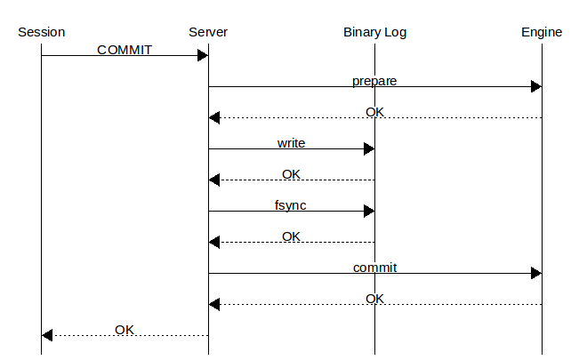

# TokuDB· Binary Log Group Commit with TokuDB

MySQL在开启Binary Log的情况下，使用2PC(图1)来保证事务(XA)完整性的，每次提交事务需要做:

```plain
 1) prepare phase:
     记录prepare信息到引擎层的Redo Log，fsync到磁盘
 2) commit phase:
     A) 记录commit信息到MySQL Server层的Binary Log，fsync到磁盘
     B) 记录commit信息到引擎层的Redo Log，fsync到磁盘
```

每个事务在提交的时候都要做3次fsync以确保日志真正的落盘，这样在log里，一个事务就会有3种状态:

```plain
 状态1: Redo Log里存在，Binary Log里也存在      --正常情况，crash恢复时需要commit
 状态2: Redo Log里存在，Binary Log里不存在      --prepare完毕后发生crash，恢复时需要rollback
 状态3: Redo Log里不存在，Binary Log里也不存在   --提交失败，无需处理
```

[](http://mysql.taobao.org/index.php?title=%E6%96%87%E4%BB%B6:2pc.png)

这样，无论处于任何一个状态，事务的完整性都不会被破坏，但是每次提交会产生3次fsync，性能非常低。   
为了提升性能，MySQL 5.6增加了group commit功能，当多个事务并发提交时，让多个都在等待fsync的事务合并做一次fsync，大大提升了吞吐量。   
但是这个优化还需要引擎层的配合，引擎层需要＂一切行动听指挥＂，不要＂任性＂的做fsync，需要对当前THD做HA\_IGNORE\_DURABILITY判断，代码如下:

```plain
 static bool tokudb_fsync_on_commit(THD *thd) {
 #if MYSQL_VERSION_ID >= 50600
     if (thd_get_durability_property(thd) == HA_IGNORE_DURABILITY)
         return false;
     else
 #endif
         return THDVAR(thd, commit_sync) != 0;
 }
```

TokuDB 7.5.4版本即将包含这个特性，官方透露，600 tokudb commits/sec只产生120个tokudb fsyncs。

上一篇： [MySQL· 优化改进· GTID启动优化](https://www.kancloud.cn/taobaomysql/monthly/213808)下一篇：[数据库内核月报 － 2014/11](https://www.kancloud.cn/taobaomysql/monthly/67020)

---------------------------------------------------


原网址: [访问](https://www.kancloud.cn/taobaomysql/monthly/67156)

创建于: 2020-04-29 11:43:01

目录: default

标签: `www.kancloud.cn`

