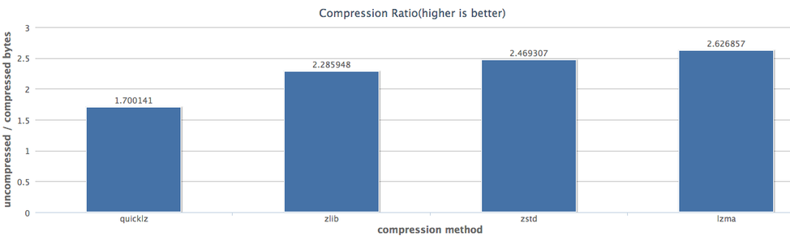
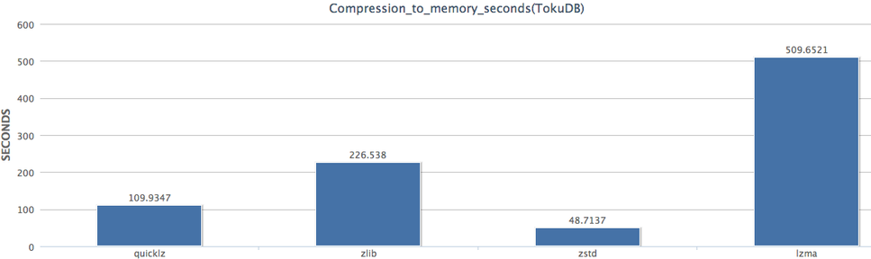

# TokuDB · 引擎特性 · zstd压缩算法

## 有4压缩很任性

TokuDB有着出色的压缩特性，这不是”盖”的：  
RDS上有个InnoDB实例，1天的数据将近700GB空间，换成TokuDB后(默认zlib压缩)，同样的700GB可以保存５天的数据，业务读写性能也无任何影响，空间成本直线下降。

为什么TokuDB的压缩这么给力？  
因为TokuDB一个“页”的大小为4MB，压缩起来，这酸爽…

## zstd新压缩算法

TokuDB支持3种压缩算法:

```plain
tokudb_quicklz: 压缩效果差，CPU消耗低
tokudb_zlib: 压缩效果偏中，CPU消耗偏中(默认)
tokudb_lzma: 压缩效果好，CPU消耗高
```

之所以提供多种压缩算法，主要是从CPU消耗和压缩效果上综合考虑的，大部分情况下 tokudb_zlib 都可以应付，而且压缩效果也不错，也是 TokuDB 默认压缩算法。  
最近压缩界出了一枚小鲜肉:[zstd压缩算法](https://github.com/Cyan4973/zstd)，由压缩专业户[Yann Collet](http://fastcompression.blogspot.com/)倾力打造。  
zstd有着非常好的压缩效果，最重要的是它CPU消耗低和压缩(解压)速度非常快，我们内部TokuDB版本已集成此算法，下面就让我们看看同样数据集的情况下，它们的效果对比：

压缩效果对比图(越高越好):  
  
zstd的压缩效果介于zlib和lzma之间，已经很理想了。

压缩时间对比图:  
  
压缩时间非常少，几乎是quicklz的一半。

相信过不了多久，你的RDS数据已经悄悄的跑在zstd压缩算法之下。  
如果你对我们所做的事情感兴趣，请抓起鼠标，敲起键盘，快快跟我们联系吧，最后悄悄说一句：

# 我们有妹子!!!

上一篇：[MySQL · 捉虫动态 · 临时表操作导致主备不一致](https://www.kancloud.cn/taobaomysql/monthly/67044)下一篇：[MySQL · 答疑解惑 · binlog 位点刷新策略](https://www.kancloud.cn/taobaomysql/monthly/67046)

---------------------------------------------------


原网址: [访问](https://www.kancloud.cn/taobaomysql/monthly/67045)

创建于: 2020-04-30 14:00:59

目录: default

标签: `www.kancloud.cn`

