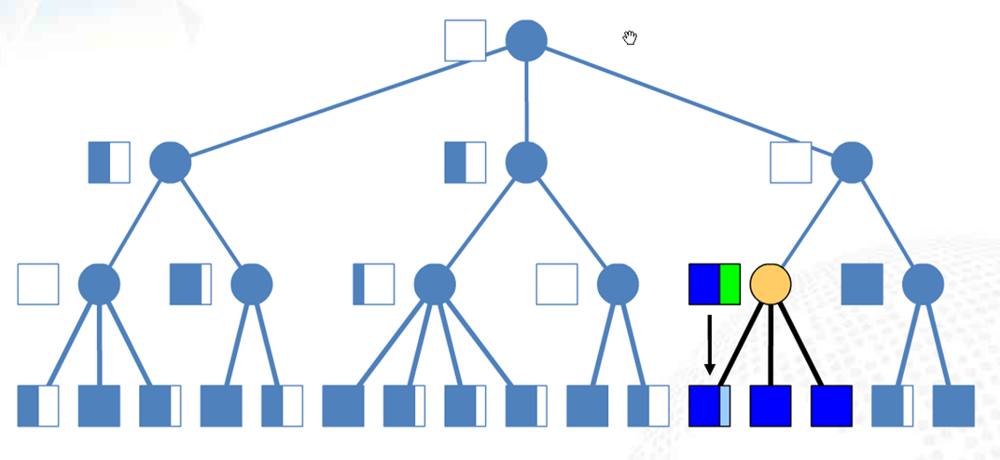
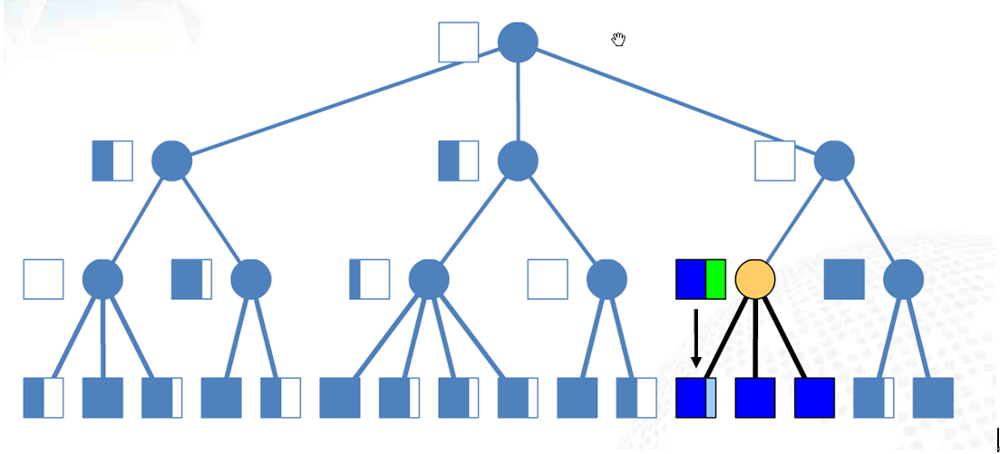
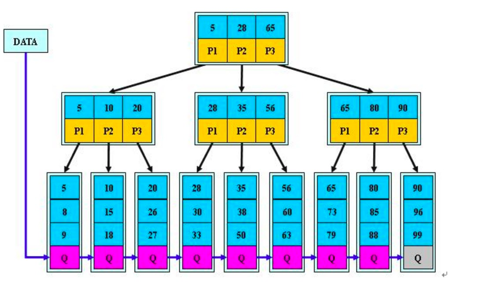
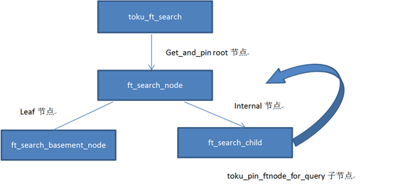

# MySQL · TokuDB · TokuDB索引结构--Fractal Tree

## 背景介绍

TokuDB采用的是Fractal Tree作为索引的数据组织方式。它是一种面向磁盘I/O优化的数据结构，采用“分期偿还”策略减少在数据插入过程中从root节点到leaf节点的搜索过程。这种搜索过程可以简称为locate\_position，就是寻找要插入key在Tree中位置的过程。

一般B+Tree的插入过程分为两个部分：

1.  Locate\_position: 从root开始使用binary search方法递归地寻找应该插入到哪个子节点上，直到在leaf节点找到应该插入的位置然后返回；
2.  Insert\_into\_postion: 在locate\_position返回的位置进行插入操作，如果当前leaf节点存储的key个数超过预定义的最大值可能会引起split操作，最坏的情况是引起从leaf节点到root节点的split。

Fractal Free把每个操作都看成一个message。每个internal节点维护了一个msg\_buffer按照FIFO顺序缓存message；索引的有序序列是在leaf节点维护的。所谓采用“分期偿还”是指：在Fractal Tree中插入时，只需要把(key, value)对插入到root节点（或者若干深度的internal节点）的msg\_buffer就可以返回了，这个过程可以简称为`push_into_root`。中间节点msg\_buffer中的message是由后台工作线程分批地flush到子节点上，最终刷到leaf节点上的，这个过程简称为`push_into_child`。与Fractal Tree类似的面向磁盘I/O优化的数据结构还有Buffer Tree [论文链接](http://www.cs.cmu.edu/~guyb/realworld/slidesF10/buffertree.pdf) 和Log Structured Merge Tree, 感兴趣的朋友可以看一下。

下面我一起看一下Fractal Tree的数据结构定义，维护Fractal Tree的基本算法的插入，删除，分裂，合并和查询过程。

## Fractal Tree数据结构

大多数情况下message不是直接插入到leaf节点上，而是被缓存在internal节点，由后台工作线程异步flush到leaf节点上。在某个时间段，对同一个key可能存在多个未applied到leaf节点的修改，每个修改对应一个message，这些message有可能缓存被在不同的internal节点上（这些internal节点一定都在从root到leaf路径上）。为了区分message的先后顺序，在插入到root节点（`push_into_root`）时，每个message被赋予了一个有序递增的序列号（msn），它是全局唯一的。

```plain
struct ftnode {
    MSN max_msn_applied_to_node_on_disk;  // applied最大的msn
    unsigned int flags; // 创建标志，等于ft->h->flags
    BLOCKNUM blocknum; // 节点对应的块号
    int    height; // 高度：0表示leaf节点，>0表示中间节点
    int    dirty; // 脏页标记，用于cachetable脏页回刷
    uint32_t fullhash; // 在cachetable的哪个bucket上
    int n_children; // partition个数
    ftnode_pivot_keys pivotkeys; // 每个partition的key值区间
    TXNID oldest_referenced_xid_known; // 最近一次push_into_root操作时系统可能的最老事务id
struct ftnode_partition *bp; // internal节点：子节点的msg_buffer; leaf节点：有序数据结构
    struct ctpair *ct_pair; // 对应cachetable的pair（cache entry）
};
```

## Fractal Tree layout



上图中蓝色圆圈表示internal节点，旁边的白色矩形表示msg\_buffer; 最下面一层蓝色矩形表示leaf节点 Fractal Tree 的bp域指向partition。对于Internal节点，bp域指向每个子节点对应的msg\_buffer。一个internal节点最多有16个（可配置）的子节点，每个子节点对应的子树保存某个key值区间的数据。对于leaf节点，bp域指向leaf节点的有序数据结构。Leaf节点可以由多个有序的子结构组成，每个子结构构称作basement节点，实际上是一个弱平衡树形结构（或者数组）。Internal节点和leaf节点的缺省大小是4M字节，basement节点的缺省大小是128K字节。从root节点到leaf节点查询的过程，是通过各级节点的 pivotkeys 来路由的。

Pivotkeys域表示子节点的key值范围：

*   第0个子节点的key范围在 ( -∞, pivotkeys\[0\] \]
*   第1个子节点的key范围在( pivotkeys\[0\]，pivotkeys\[1\] \]
*   第i个子节点的key范围在( pivotkeys\[i-1\]，pivotkeys\[i\] \]
*   最后一个子节点的key范围在( pivotkeys\[n\_children-1\]，+∞)

Bp域表示每个partition：

*   第0个partition：bp\[0\]
*   第1个partition：bp\[1\]
*   第i个partition：bp\[i\]
*   最后一个partition：bp\[n\_children-1\]

### Partition信息

```plain
struct ftnode_partition {
BLOCKNUM  blocknum; // internal节点：子节点块号;  leaf节点：unused
uint64_t     workdone; // internal节点：applied message字节数; leaf节点：unused
struct ftnode_child_pointer ptr; // internal节点：子节点msg_buffer信息; leaf节点：basement节点
enum pt_state state; // internal节点：子节点状态; leaf节点：basement节点状态
    uint8_t clock_count; // evictor线程根据此变量判断是否可以partial evict
};
enum pt_state {
    PT_INVALID = 0, // 无效
    PT_ON_DISK = 1, // 在磁盘上
    PT_COMPRESSED = 2, // 已读入内存，压缩格式
    PT_AVAIL = 3 // 已读入内存，解压缩格式
};
typedef struct ftnode_child_pointer {
    union {
        struct sub_block *subblock;  //压缩后的buffer
        struct ftnode_nonleaf_childinfo *nonleaf;  // internal节点：msg_buffer
        struct ftnode_leaf_basement_node *leaf; // leaf节点：basement节点
    } u;
 } FTNODE_CHILD_POINTER;
```

### Internal节点存储的msg\_buffer

```plain
struct ftnode_nonleaf_childinfo {
    message_buffer msg_buffer; // 缓存的message
    off_omt_t broadcast_list; // 用于支持on-line add index, on-line add column
    marked_off_omt_t fresh_message_tree; // 未apply的message在msg_buffer 里的offset，按（key，msn）顺序排序
    off_omt_t stale_message_tree; // 已经applied过的message在msg_buffer里的offset，按（key，msn）顺序排序
    uint64_t flow[2]; // 流控
};
```

### Leaf节点的basement节点

```plain
struct ftnode_leaf_basement_node {
    bn_data data_buffer; // 有序序列，弱平衡树形结构（或者数组）
    unsigned int seqinsert; // 判断顺序 insert的hint
    MSN max_msn_applied; // applied最大的msn
};
```

## 维护Fractal Tree的基本操作

### 创建新的Fractal Tree的索引

每个Fractal Tree由FT来表示。下面是列举了FT中比较重要的域。

```plain
struct ft {
    FT_HEADER h; // header
    FT_HEADER checkpoint_header; // checkpoint开始时刻header的克隆
    CACHEFILE cf; // 描述了FT对应的磁盘文件和数据节点信息。
    toku::comparator cmp; // DBT compare函数
    block_table blocktable; // FT逻辑块号到文件offset的映射表
    struct toku_list live_ft_handles; // 打开此FT的handle列表
    uint32_t num_txns;  // 访问此FT的事务个数
    bool pinned_by_checkpoint; // 表示checkpoint正在进行
    BLOCKNUM rightmost_blocknum; // 最右leaf节点块号，用于顺序insert优化
} ;
typedef struct ft *FT;
struct ft_header {
    enum ft_type type; // header类型
    int dirty; // 脏标记
    uint64_t checkpoint_count; // checkpoint计数
    LSN checkpoint_lsn; // checkpoint开始时刻的lsn
    const uint64_t time_of_creation; // FT创建时间
    TXNID root_xid_that_created; //创建FT的事务ID
    uint64_t time_of_last_modification; // 最近一次更新时间
    BLOCKNUM root_blocknum; // root节点块号
    const unsigned int flags; // 创建标志
    unsigned int nodesize; // 节点大小，缺省值4M字节
    unsigned int basementnodesize; // basement节点大小，缺省值128K字节
    enum toku_compression_method compression_method; // 压缩算法
    unsigned int fanout; // internal节点的fanout
    MSN max_msn_in_ft; // FT最大的msn
};
enum ft_type {
    FT_CURRENT = 1, // FT header
    FT_CHECKPOINT_INPROGRESS // checkpoint开始时刻FT header的克隆
};
```

创建新的Fractal Tree索引（简称FT）时候，调用函数`toku_ft_create`做一些必要的初始化工作：创建FT索引的header，创建block table（FT逻辑块号到文件offset的映射表），以及创建FT的root节点。创建root节点的过程很简单：初始化一个空的leaf节点（块号为0），并把它加到cachetable中，此时的root节点只包含一个basement节点。在leaf节点被回刷到磁盘之前会把leaf节点按照128K为单位分割成多个basement节点，这样做的好处是加速leaf节点上的查询过程。

### Fractal Tree insert

在第一节背景介绍里面谈到的，向Fractal Tree插入（key,value）对的操作是`push_into_root`。在TokuDB代码实现里面，insert操作是通过调用`toku_ft_root_put_msg`给FT发一个FT\_INSERT/FT\_INSERT\_NO\_OVERWRITE（出现duplicate key时保留老值）消息实现的。

向FT发送一个message的过程如下：

*   调用`toku_pin_ftnode`获取root节点（加share锁），这个过程中可能会引起从磁盘读取root节点的操作，在这里假设所有节点都已缓存在内存中；
*   调用`toku_ftnode_get_reactivity`判断root节点是否需要split。Leaf节点需要split的条件是：leaf节点所需的磁盘空间大于nodesize（缺省4M）；internal节点需要split的条件是：子节点个数大于fanout（缺省16）。如果需要split，root节点需要把share锁升级为exclusive锁，拿到exclusive锁后调用`ft_init_new_root`进行root分裂并生成新的root节点，这个返回时root节点块号保持不变（还是0），并持有exclusive锁，`ft_init_new_root`返回后需要把exclusive锁降级为share锁。一般情况下root节点是不要split的；
*   向root节点push message。

下面就是push message的过程：

*   如果root是leaf节点或者message是广播消息的话（比如on-line add index或者on-line add column）就把message放到root节点就可以返回了。这里需要解释一下，广播消息是需要apply到每一个leaf节点上的，所以需要从root节点向下逐级flush，不能跳过任何一个范围；
*   如果Fractal Tree的高度大于1，调用`push_something_in_subtree`把message放到root的节点的某个子树上；
*   如果Fractal Tree的高度等于1，首先调用`toku_ftnode_which_child`确定应该把message放到哪个leaf节点上。如果目标的leaf节点是最左（childnum == 0）或者最右（childnum == node->n\_children - 1) 的情况，调用`push_something_in_subtree`把message放到目标leaf节点上；否则放到root节点即可返回，最左最右的情况是优化顺序查询。最后一节会看到，一般的FT search是需要把root到leaf搜索路径上所有落在bounds区间internal节点上的message先apply到leaf节点，然后再leaf节点上进行搜索的。在TokuDB的engine层，`get_first/get_last`操作直接读取最左/最右的leaf节点，所以最左最右插入的时候需要把message 同步apply到leaf节点上的。伪代码如下：

```plain
void toku_ft_root_put_msg(FT ft, const ft_msg &msg, txn_gc_info *gc_info) {
    ftnode_fetch_extra bfe;
    bfe.create_for_full_read(ft); // fetch整个node
    pair_lock_type lock_type = PL_READ; // 初始状态：申请读锁
change_lock_type:
    toku_pin_ftnode(ft, root_key, fullhash, &bfe, lock_type, &node, true);
    enum reactivity re = toku_ftnode_get_reactivity(ft, node);
    switch (re) {
    case RE_STABLE:
case RE_FUSIBLE:
        // root节点不支持merge操作
        if (lock_type != PL_READ) {
            // 其他thread抢先做了split
            toku_unpin_ftnode_read_only(ft, node);
            lock_type = PL_READ;
            goto change_lock_type;
        }
        break;
    case RE_FISSIBLE:
        if (lock_type == PL_READ) {
            // 需要split，升级为写锁
            toku_unpin_ftnode_read_only(ft, node);
            lock_type = PL_WRITE_CHEAP;
            goto change_lock_type;
        } else {
            // root节点split
            ft_init_new_root(ft, node, &node);
            // split完成，降级为读锁
            toku_unpin_ftnode(ft, node);
            lock_type = PL_READ;
            goto change_lock_type;
        }
        break;
    }
    if (root ->height == 0 || ft_msg_type_is_broadcast(msg.type())) {
        // root是leaf节点或者messsage是广播消息，把message放到root节点上
        // 这里释放锁的原因是：inject_message_at_this_blocknum里面会重新拿锁
        toku_unpin_ftnode_read_only(ft, root);
        inject_message_at_this_blocknum(ft, root_key, fullhash, msg, flow_deltas, gc_info);
    } else if (root->height > 1) {
        // root高度大于1时，把message加到root节点的某个子树上
        push_something_in_subtree(ft, node, -1, msg, flow_deltas, gc_info, 0, LEFT_EXTREME |  RIGHT_EXTREME, false);
    } else {
        // root高度等于1时，确定message应该放到哪个leaf节点上
        int childnum = toku_ftnode_which_child(node, msg.kdbt(), ft->cmp);
        // 目标leaf节点是root的最左或最右子节点时，把message放到相应的leaf节点上
        if (childnum == 0 || childnum == node->n_children - 1) {
            push_something_in_subtree(ft, node, childnum, msg, flow_deltas, gc_info, 0, LEFT_EXTREME | RIGHT_EXTREME, false);
        } else {
            // 把message放到root节点上
            // 这里释放锁的原因是：inject_message_at_this_blocknum里面会重新拿锁
            toku_unpin_ftnode_read_only(ft, node);
            inject_message_at_this_blocknum(ft, root_key, fullhash, msg, flow_deltas, gc_info);
        }
    }
}
toku_ftnode_get_reactivity返回的reactivity定义如下：
enum reactivity {
    RE_STABLE,    // 正常状态
    RE_FUSIBLE,   // 需要merge
    RE_FISSIBLE    // 需要split
};
```

下面我们一起看一下`push_something_in_subtree`的处理过程。这里有个promotion的概念：message有可能不会直接放到root节点上，而是放到root的第一级子节点或者第二级子节点上（至多往下看两级子节点）。Promotion的一般原则：

*   只promote非广播message；
*   如果子节点对应的msg\_buffer非空，就不会递归向下promote；
*   为了优化顺序insert，如果是最左/最右的情况一定要把message apply到leaf节点上；
*   非最左/最右的情况，遇到height == 1的internal节点或者depth ==2 (已做了两级的promotion)，promote就停止了；
*   修改leaf节点是很耗时的（在后面会看到），所以一般选择把message放到internal节点上；

函数`inject_message_in_locked_node`实现了把message push到node节点上。伪代码如下：

```plain
static void inject_message_in_locked_node(FT ft, FTNODE node, int childnum, const ft_msg &msg, size_t flow_deltas[],txn_gc_info *gc_info) {
    // 生成全局（FT内）唯一的msn
    MSN msg_msn = { .msn = toku_sync_add_and_fetch(&ft->h->max_msn_in_ft.msn, 1) };
ft_msg msg_with_msn(msg.kdbt(), msg.vdbt(), msg.type(), msg_msn, msg.xids());
    toku_ftnode_put_msg(ft->cmp, ft->update_fun, node, childnum, msg_with_msn, true, gc_info, flow_deltas, &stats_delta);
if (node->height > 0 && toku_ftnode_nonleaf_is_gorged(node, ft->h->nodesize)) {
    // 如果node节点是internal节点，msg_buffer非空并且node节点所需的磁盘空间 + 各个子节点的workdone（query过程中同步flush的message大小的总和）大于nodesize（缺省4M），trigger client线程池的工作线程异步flush这个节点。
    // msg_buffer非空并且node节点所需的磁盘空间 + 各个子节点的workdone: 表示node节点逻辑上的size
   toku_ft_flush_node_on_background_thread(ft, node);
    } else {
        toku_unpin_ftnode(ft, node);
}
}
```

函数`toku_ftnode_put_msg`的作用是把message push到node节点上。如果node是internal节点，调用函数`ft_nonleaf_put_msg把message`加到msg\_buffer里面。Internal节点维护了一个FIFO队列msg\_buffer，按照message到达节点的顺序追加到FIFO尾部。Internal节点里面还维护了两个有序结构：`fresh_message_tree`和`stale_message_tree`，这两个有序结构记录了按照（key,msn）排序的message（实际上存的是message在msg\_buffer中的offset）。`fresh_message_tree`保存的是未apply的message；`stale_message_tree`保存的是在query过程中同步applied过的message。`inject_message_in_locked_node`在退出之前判断internal节点是否缓存了大量message，如果是则会把当前这个节点放到cachetable （TokuDB的buffer pool）的client线程池，让工作线程在后台把这个节点上的message flush到下一级节点。其实cachetable有个后台线程cleaner线程也在做同样的事情，但是cleaner线程是每1秒钟启动一次，而且一个cleaner线程负责处理cachetable所有需要flush的internal节点，是很有可能来不及处理的。

这里重点看一下把message 放到leaf节点的过程，这里我们不考虑广播消息。首先是调用`toku_ftnode_which_child`判断message应放到哪个basement节点上，然后调用`toku_ft_bn_apply_msg`把message放到目标basement节点上。前面函数中都没有考虑message的类型，直到这个函数才会根据message类型做不同的处理。对应insert操作，首先尝试顺序insert的优化（即跟basement最后一个key作比较，若大于最后一个key表示是升序顺序insert情况）。如果不是顺序insert的pattern，会在basement节点的有序数据结构bn里面进行binary search查找key对应的LEAFENTRY，然后调用`toku_ft_bn_apply_msg_once`在basement节点进行insert。

`toku_ft_bn_apply_msg_once`是`toku_le_apply_msg`的简单封装。`toku_le_apply_msg`伪代码如下：

```plain
toku_le_apply_msg(const ft_msg &msg,
                 LEAFENTRY old_leafentry,    // 老的LEAFENTRY
                 bn_data* data_buffer,       // basement节点的bn，如果是basement节点上第一个message，这个值NULL
                 uint32_t idx,               // old_leafentry在bn上的index
                 uint32_t old_keylen, txn_gc_info *gc_info,
                 LEAFENTRY *new_leafentry_p,  //新的LEAFENTRY
                 int64_t * numbytes_delta_p) {
    if (old_leafentry == NULL) {
        msg_init_empty_ule(&ule);
    } else {
        le_unpack(&ule, old_leafentry); // 把LEAFENTRY转成ULE
    }
    msg_modify_ule(&ule, msg);          // 把message加到ULE的MVCC
    // 把ULE转成LEAFENTRY
    // 若data_buffer == NULL，le_pack分配basement节点的bn
    int r = le_pack(&ule, data_buffer, idx, msg.kdbt()->data, keylen, old_keylen, oldmemsize, new_leafentry_p, &maybe_free);
}
```

如果是FT\_INSERT\_NO\_OVERWRITE，需要检查key是否已存在。若存在，直接退出。否则在ULE的MVCC结构添加一个类型为XR\_INSERT的provisional txn。

```plain
msg_modify_ule(ULE ule, const ft_msg &msg) {
    switch (type) {
    case FT_INSERT_NO_OVERWRITE: {
        UXR old_innermost_uxr = ule_get_innermost_uxr(ule);
        // key已存在，保留老值
        if (uxr_is_insert(old_innermost_uxr)) break;
    }
    case FT_INSERT: {
        uint32_t vallen = msg.vdbt()->size;
        void * valp = msg.vdbt()->data;
        ule_apply_insert(ule, xids, vallen, valp);
        break;
}
```

## Fractal Tree delete

在Fractal Tree删除一个对的方法是：调用函数 `toku_ft_root_put_msg` 给FT发送一个类型为 FT\_DELETE\_ANY 的message。其处理过程与insert类似，函数`msg_modify_ule`会判断message的类型，如果是FT\_DELETE\_ANY，就会给ULE的MVCC添加一个 XR\_DELETE 类型的provisional txn。

```plain
msg_modify_ule(ULE ule, const ft_msg &msg) {
    switch (type) {
    case FT_DELETE_ANY:
        ule_apply_delete(ule, xids);
        break;
    }
}
```

## LEAFENTRY的隐式提交

之前有篇月报[《MySQL·TokuDB·事务子系统和 MVCC 实现》](http://mysql.taobao.org/monthly/2016/03/01/)讨论TokuDB在事务提交一节里有这样的描述：

> 如果是root txn调用apply\_txn对rollback log的每一个item进行commit操作。如果是nested child txn把child txn的rollback log挂到parent的rollback log尾部，等到root txn 提交的时候对所有rollback log的item进行commit。需要注意的是，对于大部分DML操作rollback log item->commit都是noop。

那么在LEAFENTRY里面provisional txn是如何提交的呢？LEAFENTRY采用LAZY的方式提交，就是说provisional txn并不会在txn commit的时候变成commit txn，而是推迟到下一次修改这个LEAFENTRY的时候隐式提交。

原因是：修改LEAFENTRY需要先转成ULE结构，做完修改再把ULE转成LEAFENTRY。这样做的好处是把两次LEAFENTRY=>ULE=>LEAFENTRY合并了。Txn rollback时候，会对DML操作的key发FT\_ABORT\_ANY类型的message，这种message也是采用push到root节点（或者其下面的某个子节点）就返回。

```plain
static void
msg_modify_ule(ULE ule, const ft_msg &msg) {
    XIDS xids = msg.xids();
    enum ft_msg_type type = msg.type();
    if (type != FT_OPTIMIZE && type != FT_OPTIMIZE_FOR_UPGRADE) {
        ule_do_implicit_promotions(ule, xids);
    }
}
static void
ule_do_implicit_promotions(ULE ule, XIDS xids) {
    if (ule->num_puxrs > 0) {
        int num_xids = toku_xids_get_num_xids(xids);
        uint32_t max_index = ule->num_cuxrs + min_i32(ule->num_puxrs, num_xids) - 1;
        uint32_t ica_index = max_index;
        uint32_t index;
        for (index = ule->num_cuxrs; index <= max_index; index++) {
            TXNID current_msg_xid = toku_xids_get_xid(xids, index - ule->num_cuxrs);
            TXNID current_ule_xid = ule_get_xid(ule, index);
            if (current_msg_xid != current_ule_xid) {
                //ICA表示innermost common ancestor
                ica_index = index - 1;
                break;
            }
        }
        if (ica_index < ule->num_cuxrs) {
            // 隐式提交上一次对这个LEAFENTRY的修改
            invariant(ica_index == ule->num_cuxrs - 1);
            ule_promote_provisional_innermost_to_committed(ule);
        }
        else if (ica_index < ule->num_cuxrs + ule->num_puxrs - 1) {
            ule_promote_provisional_innermost_to_index(ule, ica_index);
        }
    }
}
```

## Cleaner线程异步flush机制

Cleaner线程找到消耗内存最多的internal节点，调用`cleaner_callback`去做flush。在`get_write_callbacks_for_node`注册的`cleaner_callback`是`toku_ftnode_clone_callback`。这个函数首先把node的所有partition读到内存，然后选择内存消耗最大的子节点，把那个节点对应的bnc缓存的message flush到相应的子节点上。

Flush bnc的过程：

*   记下需要flush的bnc；
*   新创建一个空的bnc记做new\_bnc，并用new\_bnc代替bnc来缓存新的message；
*   调用`toku_bnc_flush_to_child`把bnc缓存的message flush到子节点上。

`toku_bnc_flush_to_child`会遍历bnc的所有message，然后对每个message调用`toku_ftnode_put_msg`把message放到子节点上的。一个bnc被flush完之后，可能会引起子节点递归的flush，也可能引起节点的split或者merge。由于篇幅有限请大家自己分析。

## Fractal Tree split和merge

Fractal Tree节点的split和merge操作是自上而下进行的，这些操作都是在向这个节点push一个message之后触发的。

### Fractal Tree split

Fractal Tree节点split的条件是：

*   leaf节点：所需磁盘空间大于nodesize（缺省4M）
*   Internal节点：子节点个数大于fanout（缺省16）

Split的过程分为两个部分：

*   分割数据：对于leaf节点来说是把basement和其存储的LEAFENTRY按照split类型分为两部分；对于internal节点来说是把msg\_buffer平均分成两部分；
*   分割pivotkeys：按照第一步分割数据的方式把pivotkeys分成两部分，并把splitk加到父节点上。Split完成后这两个节点拥有相同的`max_msn_applied_to_node_on_disk`和`oldest_referenced_xid_known`。

Fratcal Tree支持的split类型：

```plain
enum split_mode {
    SPLIT_EVENLY,
    SPLIT_LEFT_HEAVY,
    SPLIT_RIGHT_HEAVY
};
```

Split之后，internal节点可能会选择进一步做flush message的操作。为什么split之后还需要flush呢？这部分代码比较晦涩，笔者认为可能是因为split的条件是子节点个数大于fanout，没有考虑到节点的逻辑大小。

### Fractal Tree merge：把相邻的两个节点合并成一个节点。

Fractal Tree节点merge的条件是：

*   Leaf节点：所需磁盘空间小于1/4 nodesize（缺省4M）
*   Internal节点：子节点个数小于1/4 fanout（缺省16）

节点merge的过程也分成两种情况：

*   Leaf节点：如果nodea大小+nodeb大小<3/4 nodesize才会考虑合并；否则，如果nodea大小<1/4 nodesize或者nodeb大小<1/4, 会balance这两个节点（先合并，再平均split成两个节点）
*   Internal节点：把msg\_buffer合并

## Rebalance leaf节点

Leaf节点被回刷到磁盘之前会调用`toku_ftnode_leaf_rebalance`函数把leaf节点的basement节点按照basementnodesize（缺省128K）大小平均分割成若干个basement节点。还记得吗？root节点刚创建的时候只有1个basement节点的。

## Fractal Tree上的查询

Fractal Free在查询方面是比较特殊的：

*   FT需要先同步flush root->leaf路径上满足查询条件的所有message
*   FT形态与B+Tree不同：leaf节点没有双向链表

  


上面的图是FT的树形结构，下面的图是B+Tree的树形结构

FT查询每次都是从root节点开始的，在internal节点中的查找是由pivotkeys路由到相应的子节点上，在leaf节点上是由pivotkeys路由到basement节点，然后在basement节点进行binary search寻找search key所在的位置。当要进行一个range查询的时候，首先使用set\_range方法找到满足查询range区间的第一个key，然后把上一次得到的key作为参数调用get\_next方法。



FT中查找key的入口函数是`toku_ft_search`。这个函数读取root节点，并根据search->key找到需要读取的子节点（`bfe.child_to_read`），然后调用`ft_search_node`在root节点的相应子节点查找。读root节点的时候，`bfe.read_all_partitions`被设置被TRUE。Root节点包含的所有paritition的信息都会从磁盘上读上来。即当root是internal节点的时候，所有子节点的msg\_buffer信息都会读到内存来；root是leaf节点的时候，所有的basement节点的有序结构都会读到内存来。伪代码如下：

```plain
int toku_ft_search(FT_HANDLE ft_handle, ft_search *search, FT_GET_CALLBACK_FUNCTION getf, void *getf_v, FT_CURSOR ftcursor, bool can_bulk_fetch)
{
try_again:
    trycount++;
    ftnode_fetch_extra bfe;
    // 只读取包含search key的那个子节点
    bfe.create_for_subset_read(ft, search, &ftcursor->range_lock_left_key,
                           &ftcursor->range_lock_right_key, ftcursor->left_is_neg_infty,
                           Ftcursor->right_is_pos_infty,ftcursor->disable_prefetching, true);
    FTNODE node = NULL;
    {
        //读取root节点，并设置bfe.child_to_read为包含search key的子节点
        toku_pin_ftnode(ft, root_key, fullhash, &bfe, PL_READ, &node, true);
    }
    struct unlock_ftnode_extra unlock_extra   = {ft_handle,node,false};
    struct unlockers  unlockers      = {true, unlock_ftnode_fun, (void*)&unlock_extra,          (UNLOCKERS)NULL};
    {
        bool doprefetch = false; bfe.child_to_read
        r = ft_search_node(ft_handle, node, search, bfe.child_to_read, getf, getf_v, &doprefetch, ftcursor, &unlockers, (ANCESTORS)NULL, pivot_bounds::infinite_bounds(), can_bulk_fetch);
        if (r==TOKUDB_TRY_AGAIN) {
            // 获取锁时需要等待或者需要partial fetch
            if (unlockers.locked) {
                toku_unpin_ftnode_read_only(ft_handle->ft, node);
            }
            goto try_again;
        } else {
            assert(unlockers.locked);
        }
    }
    assert(unlockers.locked);
    toku_unpin_ftnode_read_only(ft_handle->ft, node);
}
```

`ft_search_node` 是一个递归调用的函数，它根据 node->height 决定调用`ft_search_child`（internal节点）或者`ft_search_basement_node`（leaf节点）。`ft_search_basement_node`就是在（`node`，`bfe.child_to_read`）对应的basement节点的有序数据结构里面查找满足cmp函数的key。`ft_search_child`调用`toku_pin_ftnode_for_query`读取（`node`，`bfe.child_to_read`）表示子节点childnode。每次进入`ft_search_child`定义了一个新的bfe（记做bfe\_1）表示读取childnode节点的hint信息。读取的时候指定了`bfe_1.read_all_partitions = (childnode->height >=1)`。当childnode是internal节点时，会把所有partition的msg\_buffer都读到内存来；childnode是leaf节点的时候，只读search->key对应basement节点。`toku_pin_ftnode_for_query`采用non-blocking的方式获取childnode上的锁（这里是读锁）。Non-blocking的含义是说如果这个锁可以获取就立即返回；否则在等待之前把之前获得的从root到父节点的锁全部释放掉，然后阻塞在那个锁上。被唤醒以后立即释放锁返回TRY\_AGAIN重新从root开始search。从父节点到root节点获得的锁被记录在unlockers队列里面，队列尾部是root节点。

函数`toku_pin_ftnode_for_query`返回成功以后，会间接递归调用`ft_search_node`在childroot节点上进行搜索。`ft_search_node`还有一个副产品就是把上层传过来的bounds映射到(`node`,`bfe.child_to_read`)的key值区间，经过几次间接递归调用`ft_search_node`最终会到达leaf节点。如果是leaf节点`toku_pin_ftnode_for_query`需要检查bounds对应的key值区间的msg是否都applied过了，如果有未apply的msg，则遍历unlockers队列记录的祖先节点，把祖先节点key值在bounds范围的message flush到leaf节点上。确保所有在bounds范围的message都apply到leaf节点以后，在leaf节点对应的basement节点上进行搜索。

上一篇：[MySQL · 最佳实践 · RDS 只读实例延迟分析](https://www.kancloud.cn/taobaomysql/monthly/143938)下一篇：[MySQL · TokuDB · Savepoint漫谈](https://www.kancloud.cn/taobaomysql/monthly/143940)

---------------------------------------------------


原网址: [访问](https://www.kancloud.cn/taobaomysql/monthly/143939)

创建于: 2020-05-27 19:06:23

目录: default

标签: `www.kancloud.cn`

