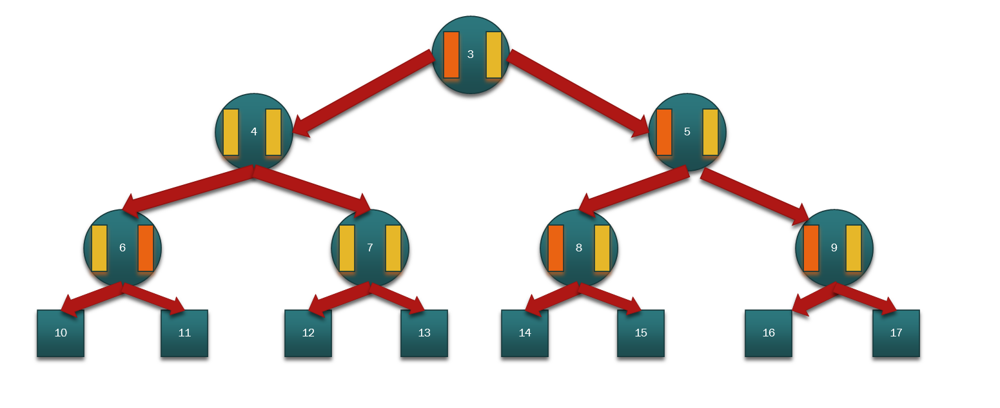
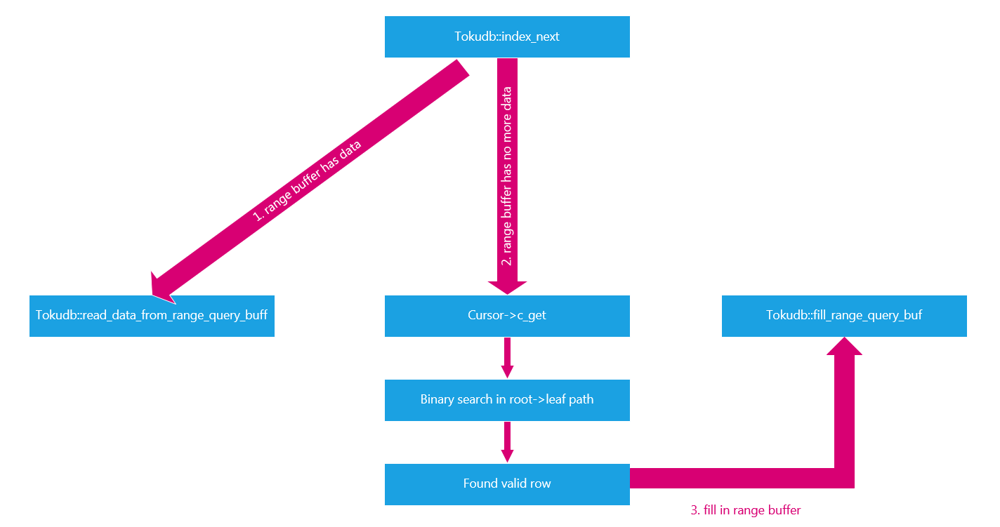
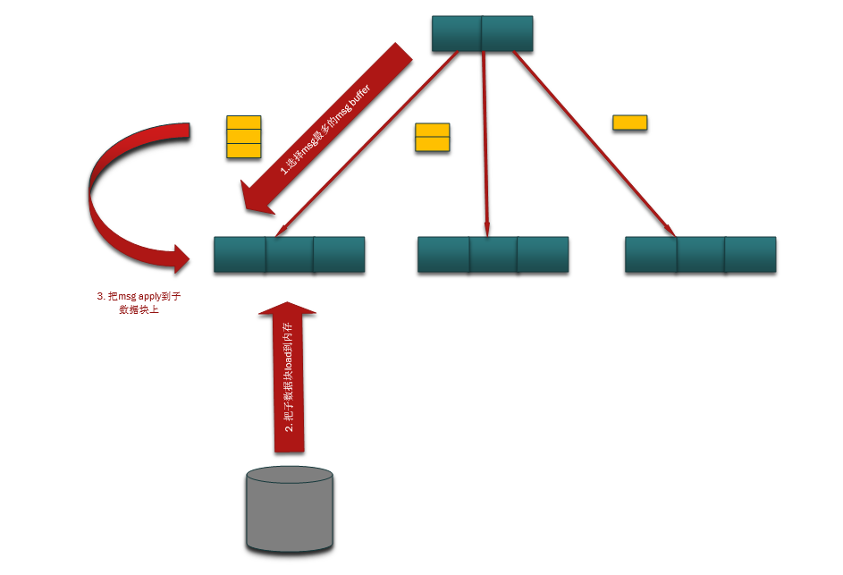
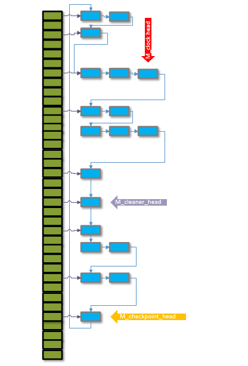
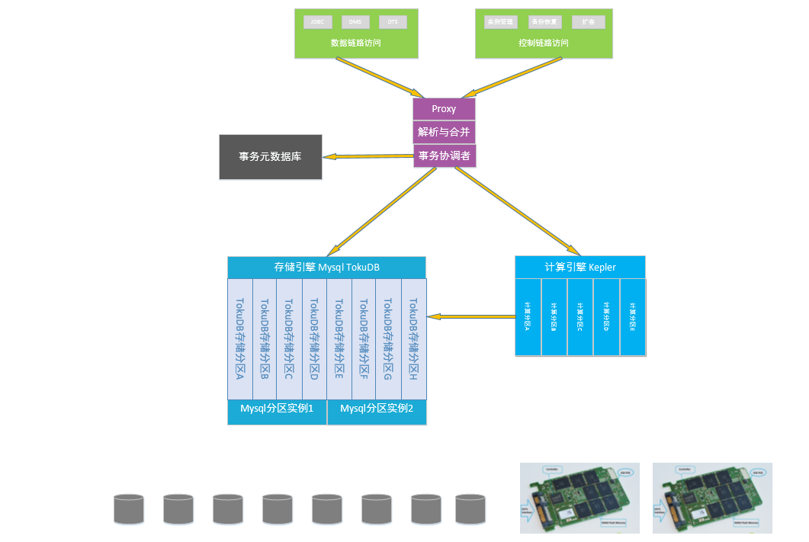
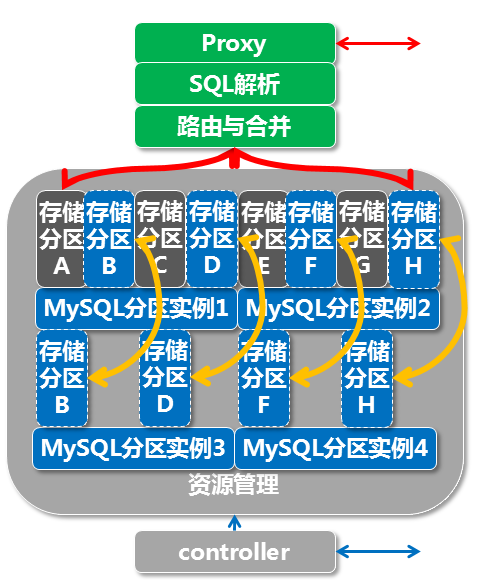
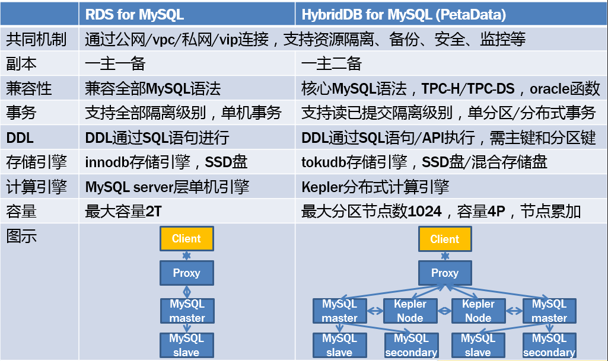
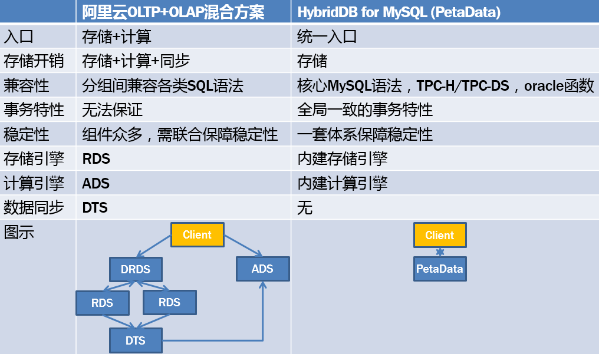
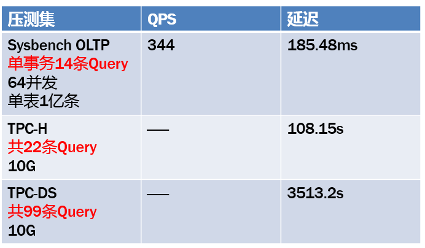
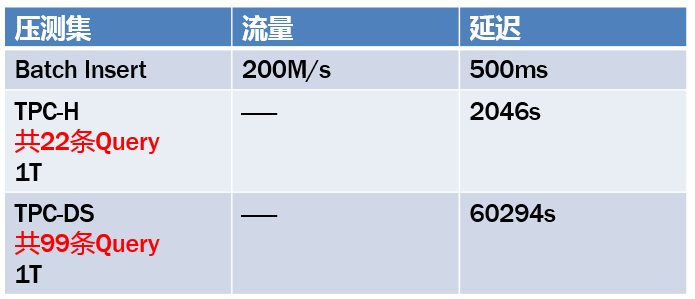

[

# 数据库内核月报 － 2017 / 07

](http://mysql.taobao.org/monthly/2017/07)

[‹](http://mysql.taobao.org/monthly/2017/07/03/)

[›](http://mysql.taobao.org/monthly/2017/07/05/)

*   [当期文章](#)

## TokuDB · 引擎特性 · HybridDB for MySQL高压缩引擎TokuDB 揭秘

HybridDB for MySQL（原名petadata）是面向在线事务（OLTP）和在线分析（OLAP）混合场景的关系型数据库。HybridDB采用一份数据存储来进行OLTP和OLAP处理，解决了以往需要把一份数据多次复制来分别进行业务交易和数据分析的问题，极大地降低了数据存储的成本，缩短了数据分析的延迟，使得实时分析决策称为可能。

HybridDB for MySQL兼容MySQL的语法及函数，并且增加了对Oracle常用分析函数的支持，100%完全兼容TPC-H和TPC-DS测试标准，从而降低了用户的开发、迁移和维护成本。

TokuDB是TokuTek公司（已被 Percona收购）研发的新引擎，支持事务/MVCC，有着出色的数据压缩功能，支持异步写入数据功能。

TokuDB索引结构采用fractal tree数据结构，是buffer tree的变种，写入性能优异，适合写多读少的场景。除此之外，TokuDB还支持在线加减字段，在线创建索引，锁表时间很短。

Percona Server和Mariadb支持TokuDB作为大数据场景下的引擎，目前官方MySQL还不支持TokuDB。ApsaraDB for MySQL从2015年4月开始支持TokuDB，在大数据或者高并发写入场景下推荐使用。

## TokuDB优势

### 数据压缩

TokuDB最显著的优势就是数据压缩，支持多种压缩算法，用户可按照实际的资源消耗修改压缩算法，生产环境下推荐使用zstd，实测的压缩比是4:1。

目前HybridDB for MySQL支持6中压缩算法：

*   lzma: 压缩比最高，资源消耗高
*   zlib：Percona默认压缩算法，最流行，压缩比和资源消耗适中
*   quicklz：速度快，压缩比最低
*   snappy：google研发的，压缩比较低，速度快
*   zstd：压缩比接近zlib，速度快
*   uncompressed：不压缩，速度最快

Percona建议6核以下场景使用默认压缩算法zlib，6核以上可以使用压缩率更高的压缩算法，大数据场景下推荐使用zstd压缩算法，压缩比高，压缩和解压速度快，也比较稳定。

用户可以在建表时使用ROW\_FORMAT子句指定压缩算法，也可用使用ALTER TABLE修改压缩算法。ALTER TABLE执行后新数据使用新的压缩算法，老数据仍是老的压缩格式。

```perl
mysql> CREATE TABLE t_test (column_a INT NOT NULL PRIMARY KEY, column_b INT NOT NULL) ENGINE=TokuDB ROW_FORMAT=tokudb_zstd;

mysql> SHOW CREATE TABLE t_test\G
       Table: t_test
Create Table: CREATE TABLE `t_test` (
  `column_a` int(11) NOT NULL,
  `column_b` int(11) NOT NULL,
  PRIMARY KEY (`column_a`)
) ENGINE=TokuDB DEFAULT CHARSET=latin1 ROW_FORMAT=TOKUDB_ZSTD

mysql> ALTER TABLE t_test ROW_FORMAT=tokudb_snappy;

mysql> SHOW CREATE TABLE t_test\G
       Table: t_test
Create Table: CREATE TABLE `t_test` (
  `column_a` int(11) NOT NULL,
  `column_b` int(11) NOT NULL,
  PRIMARY KEY (`column_a`)
) ENGINE=TokuDB DEFAULT CHARSET=latin1 ROW_FORMAT=TOKUDB_SNAPPY
```

TokuDB采用块级压缩，每个块大小是4M，这是压缩前的大小；假设压缩比是4:1，压缩后大小是1M左右。比较tricky地方是：TokuDB压缩单位是partition，大小是64K。相比innodb16K的块大小来说要大不少，更有利压缩算法寻找重复串。

上面提到，修改压缩算法后新老压缩格式的数据可以同时存在。如何识别呢？

每个数据块在压缩数据前预留一个字节存储压缩算法。从磁盘读数据后，会根据那个字节的内容调用相应的解压缩算法。

另外，TokuDB还支持并行压缩，数据块包含的多个partition可以利用线程池并行进行压缩和序列化工作，极大加速了数据写盘速度，这个功能在数据批量导入（import）情况下开启。

### 在线增减字段

TokuDB还支持在轻微阻塞DML情况下，增加或删除表中的字段或者扩展字段长度。

执行在线增减字段时表会锁一小段时间，一般是秒级锁表。锁表时间短得益于fractal tree的实现。TokuDB会把这些操作放到后台去做，具体实现是：往root块推送一个广播msg，通过逐层apply这个广播msg实现增减字段的操作。

需要注意的：

*   不建议一次更新多个字段
*   删除的字段是索引的一部分会锁表，锁表时间跟数据量成正比
*   缩短字段长度会锁表，锁表时间跟数据量成正比

```perl
mysql> ALTER TABLE t_test ADD COLUMN column_c int(11) NOT NULL;

mysql> SHOW CREATE TABLE t_test\G
       Table: t_test
Create Table: CREATE TABLE `t_test` (
  `column_a` int(11) NOT NULL,
  `column_b` int(11) NOT NULL,
  `column_c` int(11) NOT NULL,
  PRIMARY KEY (`column_a`),
  KEY `ind_1` (`column_b`)
) ENGINE=TokuDB DEFAULT CHARSET=latin1 ROW_FORMAT=TOKUDB_SNAPPY

mysql> ALTER TABLE t_test DROP COLUMN column_b;

mysql> SHOW CREATE TABLE t_test\G

       Table: t_test
Create Table: CREATE TABLE `t_test` (
  `column_a` int(11) NOT NULL,
  `column_c` int(11) NOT NULL,
  PRIMARY KEY (`column_a`)
) ENGINE=TokuDB DEFAULT CHARSET=latin1
```

### 稳定高效写入性能

TokuDB索引采用fractal tree结构，索引修改工作由后台线程异步完成。TokuDB会把每个索引更新转化成一个msg，在server层上下文只把msg加到root（或者某个internal）块msg buffer中便可返回；msg应用到leaf块的工作是由后台线程完成的，此后台线程被称作cleaner，负责逐级apply msg直至leaf块

DML语句被转化成FT\_INSERT/FT\_DELETE，此类msg只应用到leaf节点。

在线加索引/在线加字段被转化成广播msg，此类msg会被应用到每个数据块的每个数据项。

实际上，fractal tree是buffer tree的变种，在索引块内缓存更新操作，把随机请求转化成顺序请求，缩短server线程上下文的访问路径，缩短RT。所以，TokuDB在高并发大数据量场景下，可以提供稳定高效的写入性能。

除此之外，TokuDB实现了bulk fetch优化，range query性能也是不错的。

### 在线增加索引

TokuDB支持在线加索引不阻塞更新语句 (insert, update, delete) 的执行。可以通过变量 tokudb\_create\_index\_online 来控制是否开启该特性, 不过遗憾的是目前只能通过 CREATE INDEX 语法实现在线创建；如果用ALTER TABLE创建索引还是会锁表的。

```perl
mysql> SHOW CREATE TABLE t_test\G
       Table: t_test
Create Table: CREATE TABLE `t_test` (
  `column_a` int(11) NOT NULL,
  `column_b` int(11) NOT NULL,
  PRIMARY KEY (`column_a`)
) ENGINE=TokuDB DEFAULT CHARSET=latin1 ROW_FORMAT=TOKUDB_SNAPPY

mysql> SET GLOBAL tokudb_create_index_online=ON;

mysql> CREATE INDEX ind_1 ON t_test(column_b);

mysql> SHOW CREATE TABLE t_test\G
       Table: t_test
Create Table: CREATE TABLE `t_test` (
  `column_a` int(11) NOT NULL,
  `column_b` int(11) NOT NULL,
  PRIMARY KEY (`column_a`),
  KEY `ind_1` (`column_b`)
) ENGINE=TokuDB DEFAULT CHARSET=latin1 ROW_FORMAT=TOKUDB_SNAPPY
```

## 写过程

如果不考虑unique constraint检查，TokuDB写是异步完成的。每个写请求被转化成FT\_insert类型的msg，记录着要写入的<key,value>和事务信息用于跟踪。

Server上下文的写路径很短，只要把写请求对应的msg追加到roo数据块的msg buffer即可，这是LSM数据结构的核心思想，把随机写转换成顺序写，LevelDB和RocksDB也是采用类似实现。

由于大家都在root数据块缓存msg，必然造成root块成为热点，也就是性能瓶颈。

为了解决这个问题，TokuDB提出promotion概念，从root数据块开始至多往下看2层。如果当前块数据块是中间块并且msg buffer是空的，就跳过这层，把msg缓存到下一层中间块。

下面我们举例说明write过程。

假设，insert之qiafractal tree状态如下图所示：


*   insert 300

root数据块上300对应的msg buffer为空，需要进行inject promotion，也就是说会把msg存储到下面的子树上。下一级数据块上300对应的msg buffer非空（msg：291），不会继续promotion，msg被存储到当前的msg buffer。


*   insert 100

root数据块上100对应的msg buffer为空，需要进行inject promotion，也就是说会把msg存储到下面的子树上。下一级数据块上100对应的msg buffer也为空，需要继续promotion。再下一级数据块上100对应的msg buffer非空（msg：84），不会继续promotion，msg被存储到当前的msg buffer。


*   insert 211

root数据块上211对应的msg buffer为空，需要进行inject promotion，也就是说会把msg存储到下面的子树上。下一级数据块上211对应的msg buffer也为空，需要继续promotion。再下一级数据块上211对应的msg buffer也为空，但是不会继续promotion，msg被存储到当前的msg buffer。这是因为promotion至多向下看2层，这么做是为了避免dirty的数据块数量太多，减少checkpoint刷脏的压力。


### 行级锁

TokuDB提供行级锁处理并发读写数据。

所有的INSERT、DELETE或者SELECT FOR UPDATE语句在修改索引数据结构fractal tree之前，需要先拿记录（也就是key）对应的行锁，获取锁之后再去更新索引。与InnoDB行锁实现不同，InnoDB是锁记录数据结构的一个bit。

由此可见，TokuDB行锁实现导致一些性能问题，不适合大量并发更新的场景。

为了缓解行锁等待问题，TokuDB提供了行锁timeout参数（缺省是4秒），等待超时会返回失败。这种处理有助于减少deadlock发生。

## 读过程

由于中间数据块（internal block）会缓存更新操作的msg，读数据时需要先把上层msg buffer中的msg apply到叶子数据块（leaf block）上，然后再去leaf上把数据读上来。



3,4,5,6,7,8,9是中间数据块，10,11,12,13,14,15,16,17是叶子数据块；

上图中，每个中间数据块的fanout是2，表示至多有2个下一级数据块；中间节点的msg buffer用来缓存下一级数据块的msg，橘黄色表示有数据，黄绿色表示msg buffer是空的。

如果需要读block11的数据，需要先把数据块3和数据块6中的msg apply到叶子数据块11，然后去11上读数据。

Msg apply的过程也叫合并（merge），所有基于LSM原理的k-v引擎（比方LevelDB，RocksDB）读数据时都要先做merge，然后去相应的数据块上读数据。

### 读合并


如上图所示，绿色是中间数据块，紫色是叶数据块；中间数据块旁边的黄色矩形是msg buffer。

如要要query区间\[5-18\]的数据

*   以5作为search key从root到leaf搜索>=5的数据，每个数据块内部做binary search，最终定位到第一个leaf块。读数据之前，判断第一个leaf块所包含的\[5,9\]区间存在需要apply的msg（上图中是6,7,8），需要先做msg apply然后读取数据（5,6,7,8,9）；
*   第一个leaf块读取完毕，以9作为search key从root到leaf搜索>9的数据，每个数据块内部做binary search，最终定位到第二个leaf块。读数据之前，判断第二个leaf块所包含的\[10,16\]区间存在需要apply的msg（上图中是15），需要先做msg apply然后读取数据(10,12,15,16);
*   第二个leaf块读取完毕，以16作为search key从root到leaf搜索>16的数据，每个数据块内部做binary search，最终定位到第三个leaf块。第三个数据块所包含的\[17,18\]区间不存在需要apply的msg，直接读取数据（17,18）。

### 优化range query

为了减少merge代价，TokuDB提供bulk fetch功能：每个basement node大小64K（这个是数据压缩解压缩的单位）只要做一次merge操作；并且TokuDB的cursor支持批量读，一个batch内读取若干行数据缓存在内存，之后每个handler::index\_next先去缓存里取下一行数据，只有当缓存数据全部被消费过之后发起下一个batch读，再之后handler::index\_next操作还是先去缓存里取下一行数据。



Batch读过程由cursor的callback驱动，直接把数据存到TokuDB handler的buffer中，不仅减少了merge次数，也减少了handler::index\_next调用栈深度。

## 异步合并

TokuDB支持后台异步合并msg，把中间数据块中缓存的msg逐层向下刷，直至leaf数据块。

这过程是由周期运行的cleaner线程完成的，cleaner线程每秒被唤醒一次。每次执行扫描一定数目的数据块，寻找缓存msg最多的中间数据块；扫描结束后，把msg buffer中的msg刷到（merge）下一层数据块中。



前面提到，大部分写数据并不会把msg直接写到leaf，而是把msg缓存到root或者某一级中间数据块上。虽然promotion缓解了root块热点问题，局部热点问题依然存在。

假设某一个时间段大量并发更新某范围的索引数据，msg buffer短时间内堆积大量msg；由于cleaner线程是单线程顺序扫描，很可能来不及处理热点数据块，导致热点数据msg堆积，并且数据块读写锁争抢现象越来越严重。

为了解决这个问题，TokuDB引入了专门的线程池来帮助cleaner线程快速处理热点块。大致处理是：如果msg buffer缓存了过多的msg，写数据上下文就会唤醒线程池中的线程帮助cleaner快速合并当前数据块。

## 刷脏

为了加速数据处理过程，TokuDB在内存缓存数据块，所有数据块组织成一个hash表，可以通过hash计算快速定位，这个hash表被称作cachetable。InnoDB也有类似缓存机制，叫做buffer pool（简记bp）。

内存中数据块被修改后不会立即写回磁盘，而是被标记成dirty状态。Cachetable满会触发evict操作，选择一个victim数据块释放内存。如果victim是dirty的，需要先把数据写回。Evict操作是由后台线程evictor处理的，缺省1秒钟运行一次，也可能由于缓存满由server上下文触发。

TokuDB采用激进的缓存策略，尽量把数据保留在内存中。除了evictor线程以外，还有一个定期刷脏的checkpoint线程，缺省60每秒运行一次把内存中所有脏数据回刷到磁盘上。Checkpoint结束后，清理redo log文件。

TokuDB采用sharp checkpoint策略，checkpoint开始时刻把cachetable中所有数据块遍历一遍，对每个数据块打上checkpoint\_pending标记，这个过程是拿着client端exclusive锁的，所有INSERT/DELETE操作会被阻塞。标记checkpoint\_pending过程结束后，释放exclusive锁，server的更新请求可以继续执行。

随后checkpoint线程会对每个标记checkpoint\_pending的脏页进行回写。为了减少I/O期间数据块读写锁冲突，先把数据clone一份，然后对cloned数据进行回写；clone过程是持有读写锁的write锁，clone结束后释放读写锁，数据块可以继续提供读写服务。Cloned数据块写回时，持有读写I/O的mutex锁，保证on-going的I/O至多只有一个。

更新数据块发现是checkpoint\_pending并且dirty，那么需要先把老数据写盘。由于checkpoint是单线程，可能来不及处理这个数据块。为此，TokuDB提供一个专门的线程池，server上下文只要把数据clone一份，然后把回写cloned数据的任务扔给线程池处理。

## Cachetable

所有缓存在内存的数据块按照首次访问（cachemiss）时间顺序组织成clock\_list。TokuDB没有维护LRU list，而是使用clock\_list和count（可理解成age）来模拟数据块使用频率。

Evictor，checkpoint和cleaner线程（参见异步合并小结）都是扫描clock\_list，每个线程维护自己的head记录着下次扫描开始位置。



如上图所示，hash中黑色连线表示bucket链表，蓝色连线表示clock\_list。Evictor，checkpoint和cleaner的header分别是m\_clock\_head,m\_checkpoint\_head和m\_cleaner\_head。

数据块被访问，count递增（最大值15）；每次evictor线程扫到数据块count递减，减到0整个数据块会被evict出去。

TokuDB块size比较大，缺省是4M；所以按照块这个维度去做evict不是特别合理，有些partition数据比较热需要在内存多呆一会，冷的partition可以尽早释放。

为此，TokuDB还提供partial evict功能，数据块被扫描时，如果count>0并且是clean的，就把冷partition释放掉。Partial evict对中间数据块（包含key分布信息）做了特殊处理，把partition转成压缩格式减少内存使用，后续访问需要先解压缩再使用。Partial evict对leaf数据块的处理是：把partition释放，后续访问需要调用pf\_callback从磁盘读数据，读上来的数据也是先解压缩的。

## 写优先

这里说的写优先是指并发读写数据块时，写操作优先级高，跟行级锁无关。


假设用户要读区间\[210, 256\]，需要从root->leaf每层做binary search，在search之前要把数据块读到内存并且加readlock。

如上图所示，root（height 3）和root子数据块（height 2）尝试读锁（try\_readlock）成功，但是在root的第二级子数据块（height 1）尝试读锁失败，这个query会把root和root子数据块（height 2）读锁释放掉，退回到root重新尝试读锁。

## 日志

TokuDB采用WAL（Write Ahead Log），每个INSERT/DELETE/CREATE INDEX/DROP INDEX操作之前会记redo log和undo log，用于崩溃恢复和事务回滚。

TokuDB的redo log是逻辑log，每个log entry记录一个更新事件，主要包含：

*   长度1
*   log command（标识操作类型）
*   lsn
*   timestamp
*   事务id
*   crc
*   db
*   key
*   val
*   长度2

其中，db，key和val不是必须的，比如checkpoint就没有这些信息。

长度1和长度2一定是相等的，记两个长度是为了方便前向（backward）和后向（forward）扫描。

Recory过程首先前向扫描，寻找最后一个有效的checkpoint；从那个checkpoint开始后向扫描回放redo log，直至最后一个commit事务。然后把所有活跃事务abort掉，最后做一个checkpoint把数据修改同步到磁盘上。

TokuDB的undo日志是记录在一个单独的文件上，undo日志也是逻辑的，记录的是更新的逆操作。独立的undo日志，避免老数据造成数据空间膨胀问题。

## 事务和MVCC

相对RocksDB，TokuDB最显著的优势就是支持完整事务，支持MVCC。

TokuDB还支持事务嵌套，可以用来实现savepoint功能，把一个大事务分割成一组小事务，小事务失败只要重试它自己就好了，不用回滚整个事务。

### ISOLATION LEVEL

TokuDB支持隔离级别：READ UNCOMMITTED, READ COMMITTED (default), REPEATABLE READ, SERIALIZABLE。SERIALIZABLE是通过行级锁实现的；READ COMMITTED (default),和REPEATABLE READ是通过snapshot实现。

TokuDB支持多版本，多版本数据是记录在页数据块上的。每个leaf数据块上的<key,value>二元组，key是索引的key值（其实是拼了pk的），value是MVCC数据。这与oracle和InnoDB不同，oracle的多版本是通过undo segment计算构造出来的。InnoDB MVCC实现原理与oracle近似。

### 事务的可见性

每个写事务开始时都会获得一个事务id（TokuDB记做txnid，InnoDB记做trxid）。其实，事务id是一个全局递增的整数。所有的写事务都会被加入到事务mgr的活跃事务列表里面。

所谓活跃事务就是处于执行中的事务，对于RC以上隔离界别，活跃事务都是不可见的。前面提到过，SERIALIZABLE是通过行级锁实现的，不必考虑可见性。

一般来说，RC可见性是语句级别的，RR可见性是事务级别的。这在TokuDB中是如何实现的呢？

每个语句执行开始都会创建一个子事务。如果是RC、RR隔离级别，还会创建snapshot。Snapshot也有活跃事务列表，RC隔离级别是复制事务mgr在语句事务开始时刻的活跃事务列表，RR隔离级别是复制事务mgr在server层事务开始时刻的活跃事务列表。

Snapshot可见性就是事务id比snapshot的事务id更小，意味着更早开始执行；但是不在snapshot活跃事务列表的事务。

### GC

随着事务提交snapshot结束，老版本数据不在被访问需要清理，这就引入了GC的问题。

为了判断写事务的更新是否被其他事务访问，TokuDB的事务mgr维护了reference\_xids数组，记录事务提交时刻，系统中处于活跃状态snapshot个数，作用相当于reference\_count。

以上描述了TokuDB如何跟踪写事务的引用者。那么GC是何时执行的呢？

可以调用OPTIMIZE TABLE显式触发，也可以在后续访问索引key时隐式触发。

## 典型业务场景

以上介绍了TokuDB引擎内核原理，下面我们从HybridDB for MySQL产品的角度谈一下业务场景和性能。

HybridDB for MySQL设计目标是提供低成本大容量分布式数据库服务，一体式处理OLTP和OLAP混合业务场景，提供存储和计算能力；而存储和计算节点在物理上是分离的，用户可以根据业务特点定制存储计算节点的配比，也可以单独购买存储和计算节点。

HybridDB for MySQL数据只存储一份，减少数据交换成本，同时也降低了存储成本；所有功能集成在一个实例之中，提供统一的用户接口，一致的数据视图和全局统一的SQL兼容性。

HybridDB for MySQL支持数据库分区，整体容量和性能随分区数目增长而线性增长；用户可先购买一个基本配置，随业务发展后续可以购买更多的节点进行扩容。HybridDB for MySQL提供在线的扩容和缩容能力，水平扩展/收缩存储和计算节点拓扑结构；在扩展过程中，不影响业务对外提供服务，优化数据分布算法，减少重新分布数据量；采用流式迁移，备份数据不落地。

除此之外，HybridDB for MySQL还支持高可用，复用链路高可用技术，采用一主多备方式实现三副本。HybridDB for MySQL复用ApsaraDB for MySQL已有技术框架，部署、升级、链路管理、资源管理、备份、安全、监控和日志复用已有功能模块，技术风险低，验证周期短，可以说是站在巨人肩膀上的创新。



### 低成本大容量存储场景

HybridDB for MySQL使用软硬件整体方案解决大容量低成本问题。

软件方面，HybridDB for MySQL是分布式数据库，摆脱单机硬件资源限制，提供横向扩展能力，容量和性能随节点数目增加而线性增加。存储节点MySQL实例选择使用TokuDB引擎，支持块级压缩，压缩算法以表单位进行配置。用户可根据业务自身特点选择使用压缩效果好的压缩算法比如lzma，也可以选择quicklz这种压缩速度快资源消耗低的压缩算法，也可以选择像zstd这种压缩效果和压缩速度比较均衡的压缩算法。如果选用zstd压缩算法，线上实测的压缩比是3~4。

硬件方面，HybridDB for MySQL采用分层存储解决方案，大量冷数据存储在SATA盘上，少量温数据存储在ssd上，热数据存储在数据库引擎的内存缓存中（TokuDB cachetable）。SATA盘和ssd上数据之间的映射关系通过bcache驱动模块来管理，bcache可以配置成WriteBack模式（写路径数据写ssd后即返回，ssd中更新数据由bcache负责同步到SATA盘上），可加速数据库checkpoint写盘速度；也可以配置成WriteThrough模式（写路径数据同时写到ssd和SATA上，两者都ack写才算完成）。

### 持续高并发写入场景

TokuDB采用fractal tree（中文译作分型树）数据结构，优化写路径，大部分二级索引的写操作是异步的，写被缓存到中间数据块即返回。写操作同步到叶数据块可以通过后台cleaner线程异步完成，也可能由后续的读操作同步完成（读合并）。Fractal tree在前面的内核原理部分有详尽描述，这里就不赘述了。

细心的朋友可能会发现，我们在异步写前加了个前缀：大部分二级索引。那么大部分是指那些情况呢？这里大部分是指不需要做quickness检查的索引，写请求直接扔给fractal tree的msg buffer即可返回。如果二级索引包含unique索引，必须先做唯一性检查保证不存在重复键值。否则，异步合并（或者读合并）无法通知唯一性检查失败，也无法回滚其他索引的更新。Pk字段也有类似的唯一性语义，写之前会去查询pk键值是否已存在，顺便做了root到leaf数据块的预读和读合并。所以，每条新增数据执行INSERT INTO的过程不完全是异步写。

ApsaraDB for MySQL对于日志场景做了优化，利用INSERT IGNORE语句保证pk键值唯一性，并且通过把二级索引键值1-1映射到pk键值空间的方法保证二级索引唯一性，将写操作转换成全异步写，大大降低了写延迟。由于省掉唯一性检查的读过程，引擎在内存中缓存的数据量大大减少，缓存写请求的数据块受读干扰被释放的可能性大大降低，进而写路径上发生cachetable miss的可能性降低，写性能更加稳定。

### 分布式业务场景

HybridDB for MySQL同时提供单分区事务和分布式事务支持，支持跨表、跨引擎、跨数据库、跨MySQL实例，跨存储节点的事务。HybridDB for MySQL使用两阶段提交协议支持分布式事务，提交阶段proxy作为协调者将分布式事务状态记录到事务元数据库；分区事务恢复时，proxy从事务元数据库取得分布式事务状态，并作为协调者重新发起失败分区的事务。

HybridDB for MySQL还可以通过判断WHERE条件是否包含分区键的等值条件，决定是单分区事务还是分布式事务。如果是单分区事务，直接发送给分区MySQL实例处理。

### 在线扩容/缩容场景

HybridDB for MySQL通过将存储分区无缝迁移到更多（或更少的）MySQL分区实例上实现弹性数据扩展（收缩）的功能，分区迁移完成之后proxy层更新路由信息，把请求切到新分区上，老分区上的数据会自动清理。Proxy切换路由信息时会保持连接，不影响用户业务。

数据迁移是通过全量备份+增量备份方式实现，全量备份不落地直接流式上传到oss。增量备份通过binlog方式同步，HybridDB for MySQL不必自行实现binlog解析模块，而是利用ApsaraDB for MySQL优化过的复制逻辑完成增量同步，通过并行复制提升性能，并且保证数据一致性。



### 聚合索引提升读性能

TokuDB支持一个表上创建多个聚合索引，以空间代价换取查询性能，减少回pk取数据。阿里云ApsaraDB for MySQL在优化器上对TokuDB聚合索引做了额外支持，在cost接近时可以优先选择聚合索引；存在多个cost接近的聚合索引，可以优先选择与WHERE条件最匹配的聚合索引。

### 与单机版ApsaraDB for MySQL对比



### 与阿里云OLTP+OLAP混合方案对比



## 性能报告

### 高并发业务

压测配置：

*   4节点，每节点8-core，32G，12000 iops，ssd盘



### 高吞吐业务

压测配置：

*   8节点，每节点16-core，48G，12000 iops，ssd盘



最后，HybridDB for MySQL目前处于快速发展阶段，正在承接阿里集团内外各种日志和分析报表业务。欢迎大家使用，欢迎多提宝贵意见！

[阿里云RDS-数据库内核组](http://mysql.taobao.org/)  
[欢迎在github上star AliSQL](https://github.com/alibaba/AliSQL)  
阅读： -  
[](http://creativecommons.org/licenses/by-nc-sa/3.0/)  
本作品采用[知识共享署名-非商业性使用-相同方式共享 3.0 未本地化版本许可协议](http://creativecommons.org/licenses/by-nc-sa/3.0/)进行许可。

---------------------------------------------------


原网址: [访问](http://mysql.taobao.org/monthly/2017/07/04/)

创建于: 2020-05-28 15:34:23

目录: default

标签: `mysql.taobao.org`

